# Тема 2. Базовые операции языка Python
Отчет по Теме #2 выполнил(а):
- Новоселов Артем Вячеславович
- АИС-22-1

| Задание | Лаб_раб | Сам_раб |
| ------ | ------ | ------ |
| Задание 1 | + | - |
| Задание 2 | + | - |
| Задание 3 | + | - |
| Задание 4 | + | - |
| Задание 5 | + | - |
| Задание 6 | + | - |
| Задание 7 | + | - |
| Задание 8 | + | - |
| Задание 9 | + | - |
| Задание 10 | + | - |

знак "+" - задание выполнено; знак "-" - задание не выполнено;

Работу проверили:
- к.э.н., доцент Панов М.А.

## Лабораторная работа №1
### Выведите в консоль три строки. Первая – любое число. Вторая – любое число в виде строки. Третья – любое число с плавающей точкой.

```python
print(111)
print("111")
print(1.11)
```
### Результат.


## Выводы

В данном коде выводятся три строки с использованием функции `print()`. Каждая строка содержит разные значения:

1. `print(111)`: Выводится целое число 111. 

2. `print("111")`: Выводится строка '111'. Использование "" указывает на принадлежность выражения к типу "string" 

3. `print(1.11)`: Выводится число с плавающей точкой 1.11.

## Лабораторная работа №2
### Выведите в консоль три строки. Первая – результат сложения или вычитания минимум двух переменных типа int. Вторая – результат сложения или вычитания минимум двух переменных типа float. Третья – результат сложения или вычитания минимум двух переменных типа int и float.

```python
int1 = 10
int2 = 20
f1 = 5.2
f2 = 10.5

print(int1 + int2)
print(f1 + f2)
print(int1 + f2)
```
### Результат.

## Выводы:
1. `print(int1 + int2)`: int+int => Выводится целое число. 

2. `print(f1 + f2)`: float+float => Выводится число с плавающей точкой. 

3. `print(int1 + f2)`: int + float  => Выводится число с плавающей точкой.

## Лабораторная работа №3
### Выведите в консоль три строки. Первая – обычная строка. Вторая – F строка с использованием заранее объявленной переменной. Третья – сложите две или более строк в одну
```python
x = 5
print("Первая строка")
print(f'Вторая строка с числом {x}')
hello = "hello "
world = "world"
print(hello + world)
```
### Результат.
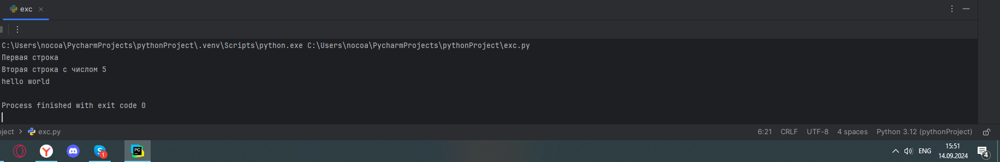
## Выводы
1. `print("Первая строка")`: Выводится обычная строка 

2. `print(f'Вторая строка с числом {x}')`: конструкция `f'строка {переменная}...'` позволяет использовать переменные внутри строки. 

3. `print(hello + world)`: Результатом сложения двух строковых переменных является одна строка вида с последовательно объединенными значениями переменных  
  
## Лабораторная работа №4
### Выведите в консоль три строки. Первая – трансформация любого типа переменной в bool. Вторая – трансформация любого типа переменной в float или int. Третья – трансформация любого типа переменной в str
```python
x = 5
print(bool(x))
f1 = 5.01
print(int(f1))
int1 = 5
print(str(int1))
```
### Результат
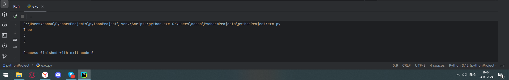
## Выводы
1. `print(bool(x))`: Число больше нуля в результате трансформации `bool` становится значением `True`

2. `print(int(f1))`: Число с плавающей точкой результате трансформации `int` становится целочисленным значением, округленным в "меньшую" сторону

3. `print(str(int1))`: Численное значение становится строковым в результате трансформации `str`

## Лабораторная работа №5
### Присвойте трем переменным различные значения, воспользовавшись функцией input()
```python
int1 = input(int)
float1 = input(float)
str1 = input(str)
print(int1, float1, str1)
```
### Результат
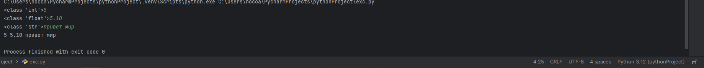
## Выводы
1. `int1 = input(int)`: Переменной присваивается целочисленное значение

2. `float1 = input(float)`: Переменной присваивается числовое значение с плавающей точкой

3. `str1 = input(str)`: Переменной присваивается строковое значение

## Лабораторная работа №6
### Создайте две любые числовые переменные и выполните над ними несколько математических операций: возведение в степень, обычное деление, целочисленное деление, нахождение остатка от деления. При желании вы можете проверить как работают эти вычисления с разными типами данных, например, сначала создать две переменные int, затем создать две переменные float и наконец создать переменные типа int и float и провести над ними операции, прописанные выше.
```python
a = 4
b = 12
print("Умножение", a**a)
print("Деление", b/a)
print("Целочисленное деление", b//a)
print("Остаток деления", b%a)
```
### Результат
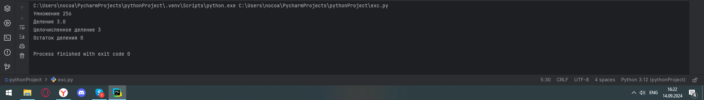
## Выводы
1. `print("Умножение", a**a)`: Выводится результат возведения в степень `a` перемееной `a`

2. `print("Деление", b/a)`: Выводится результат деления `b` на `a`

3. `print("Целочисленное деление", b//a)`: Выводится результат целочисленного деления `b` на `a`
  
4. `print("Остаток деления", b%a)`: Выводится остаток деления `b` на `a`

## Лабораторная работа №7
### Создайте любую строковую переменную и произведите над ней математическое действие умножение на любое число.
```python
line = "hello"
print(line*5)
```
### Результат
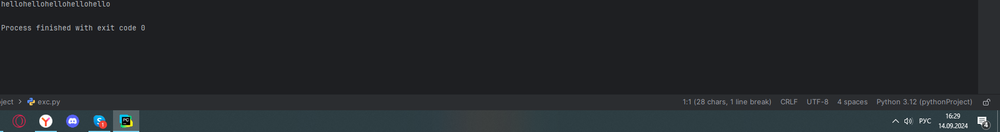
## Выводы
В результате умножения строки на число получается значение переменной строки столько раз, чему равно число  


## Лабораторная работа №8
### Посчитайте сколько раз символ ‘o’ встречается в строке ‘Hello World’.
```python
line = "Hello World"
print(line.count("o"))
```
### Результат
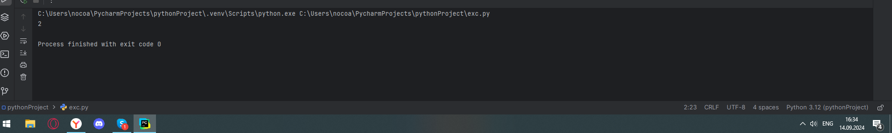
## Выводы
В результате выполнения функции `count(символ)` над строковой переменной присваивается число искомых символов в строке 

## Лабораторная работа №9
### Напишите предложение ‘Hello World’ в две строки. Написанная программа должна занимать одну строку в редакторе кода.
```python
print('Hello \nWorld')
```
### Результат
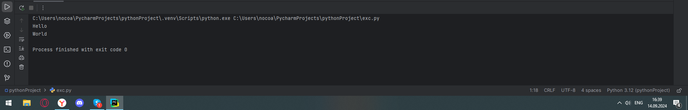
## Выводы
Служебный символ \n обеспечивает перенос строки

## Лабораторная работа №10
### Из предложения ‘Hello World’ выведите в консоль только 2 символ, а затем выведите слово ‘Hello’
```python
line = ("Hello World")
print(line[1])
print(line[:5])
```
### Результат
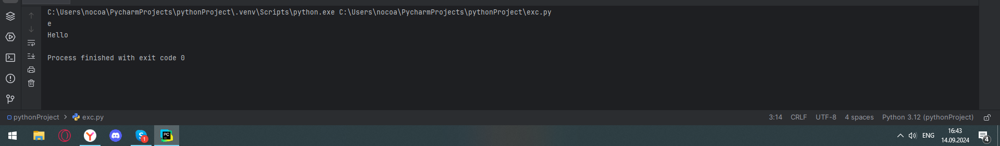
## Выводы
С помощью [] можно получать значения отдельных конкретных символов строки

## Самостоятельная работа №1
### Выведите в консоль булевую переменную False, не используя слово False в строке или изначально присвоенную булевую переменную. Программа должна занимать не более двух строк редактора кода.
```python
print(bool(0))
```
### Результат
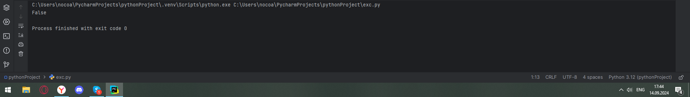
## Выводы
Ноль при транформации `bool` преобразуется в `False`

  
## Самостоятельная работа №2
### Присвоить значения трем переменным и вывести их в консоль, используя только две строки редактора кода
```python
a = 2; b = 3; c =4;
print(a, b, c)
```
### Результат
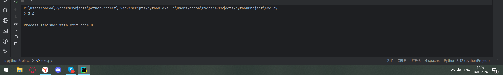
## Выводы
Переменные можно определять в одну строку через знак ";"
  
## Самостоятельная работа №3
### Реализуйте ввод данных в программу, через консоль, в виде только целых чисел (тип данных int). То есть при вводе буквенных символов в консоль, программа не должна работать. Программа должна занимать не более двух строк редактора кода
```python
a = int(input());
print(a);
```
### Результат
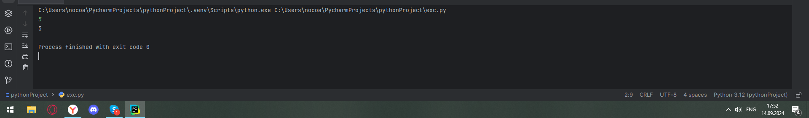
## Выводы
конструкция `int(input())` позволяет отслеживать тип введенных данных и вызывать ошибку, если они не целочисленные 
  
## Самостоятельная работа №4
### Создайте только одну строковую переменную. Длина строки должна не превышать 5 символов. На выходе мы должны получить строку длиной не менее 16 символов. Программа должна занимать не более двух строк редактора кода. 
```python
line = "qwer"
print(line*30)
```
### Результат
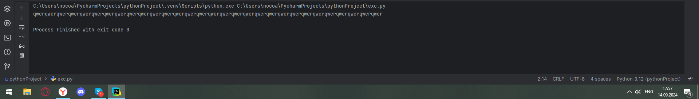
## Выводы
В результате умножения строки на число получается значение переменной строки столько раз, чему равно число 
  
## Самостоятельная работа №5
### Создайте три переменные: день (тип данных - числовой), месяц (тип данных - строка), год (тип данных - числовой) и выведите в консоль текущую дату в формате: “Сегодня день месяц год. Всего хорошего!” используя F строку и оператор end внутри print(), в котором вы должны написать фразу “Всего хорошего!”. Программа должна занимать не более двух строк редактора кода. 
```python
day = 1; month = "сентября"; year = 2000
print(f"Сегодня {day} {month} {year}. ", end = "Всего хорошего!")
```
### Результат
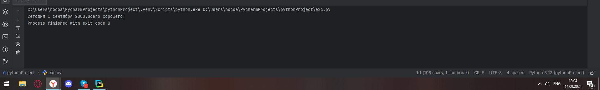
## Выводы
Оператор `end` позволяет дописать символы в конец предложения  
  
## Самостоятельная работа №6
### В предложении ‘Hello World’ вставьте ‘my’ между двумя словами. Выведите полученное предложение в консоль в одну строку. Программа должна занимать не более двух строк редактора кода.
```python
my = "my"
print(f"Hello {my} World")
```
### Результат
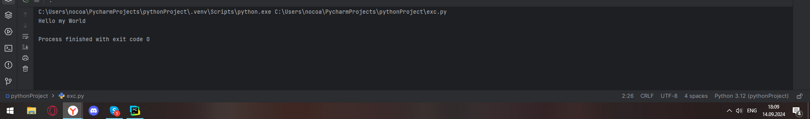
## Выводы
конструкция `f'строка {переменная}...'` позволяет использовать переменные внутри строки. 
  
## Самостоятельная работа №7
### Узнайте длину предложения ‘Hello World’, результат выведите в консоль. Программа должна занимать не более двух строк редактора кода
```python
line = "Hello world"
print(len(line))
```
### Результат
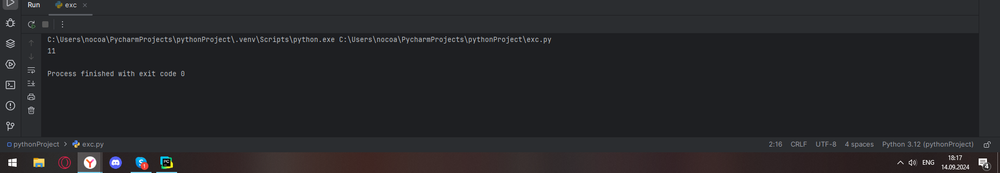
## Выводы
метод `len()` позволяет узнать длину строки (количество ее символов)
   
## Самостоятельная работа №8
### Переведите предложение ‘HELLO WORLD’ в нижний регистр. Программа должна занимать не более двух строк редактора кода
```python
line = "HELLO WORLD"
print(line.lower())
```
### Результат
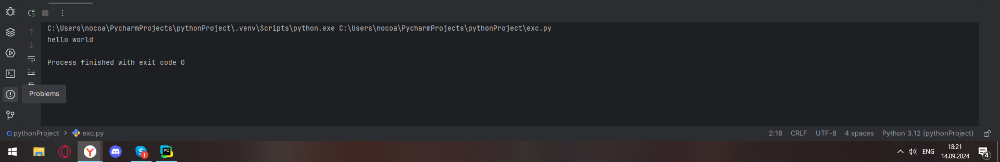
## Выводы
метод `lower()` позволяет сменить регистр строки на нижний
  
## Самостоятельная работа №9
### Самостоятельно придумайте задачу по проходимой теме и решите ее. Задача должна быть связана со взаимодействием с числовыми значениями.
### Задача: проверить, можно ли возвести число с плавающей точкой в степень числа с плавающей точкой
```python
f1 = 3.5
print(f1**f1)
```
### Результат
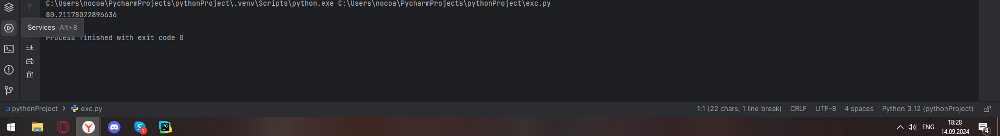
## Выводы
можно возвести число с плавающей точкой в степень числа с плавающей точкой
  
## Самостоятельная работа №10
### Самостоятельно придумайте задачу по проходимой теме и решите ее. Задача должна быть связанна со взаимодействием со строковыми значениями.
### Задача: в строке "Hello world" вывести символы с 3 по 5
```python
line = "hello world"
print(line[2:5])
```
### Результат
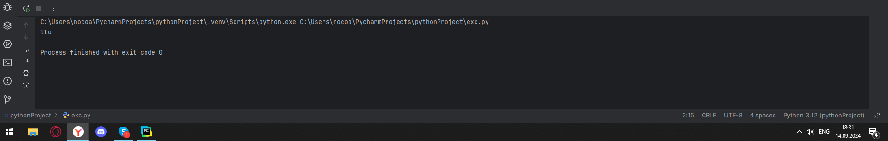
## Выводы
нужную часть строки возможно вывести с помощью конструкции [индекс первого символа:индекс последнего символа-1]

## Общие выводы по теме

