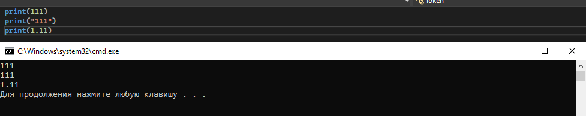
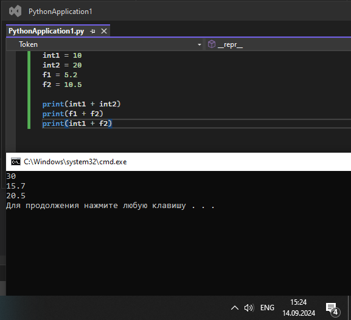

# Тема 2. Базовые операции языка Python
Отчет по Теме #2 выполнил(а):
- Новоселов Артем Вячеславович
- АИС-22-1

| Задание | Лаб_раб | Сам_раб |
| ------ | ------ | ------ |
| Задание 1 | + | - |
| Задание 2 | + | - |
| Задание 3 | - | - |
| Задание 4 | - | - |
| Задание 5 | - | - |
| Задание 6 | - | - |
| Задание 7 | - | - |
| Задание 8 | - | - |
| Задание 9 | - | - |
| Задание 10 | - | - |

знак "+" - задание выполнено; знак "-" - задание не выполнено;

Работу проверили:
- к.э.н., доцент Панов М.А.

## Лабораторная работа №1
### Выведите в консоль три строки. Первая – любое число. Вторая – любое число в виде строки. Третья – любое число с плавающей точкой.

```python
print(111)
print("111")
print(1.11)
```
### Результат.


## Выводы

В данном коде выводятся три строки с использованием функции `print()`. Каждая строка содержит разные значения:

1. `print(111)`: Выводится целое число 111. 

2. `print("111")`: Выводится строка '111'. Использование "" указывает на принадлежность выражения к типу "string" 

3. `print(1.11)`: Выводится число с плавающей точкой 1.11.

## Лабораторная работа №2
### Выведите в консоль три строки. Первая – результат сложения или вычитания минимум двух переменных типа int. Вторая – результат сложения или вычитания минимум двух переменных типа float. Третья – результат сложения или вычитания минимум двух переменных типа int и float.

```python
int1 = 10
int2 = 20
f1 = 5.2
f2 = 10.5

print(int1 + int2)
print(f1 + f2)
print(int1 + f2)
```
### Результат.

## Выводы:
1. `print(int1 + int2)`: int+int => Выводится целое число. 

2. `print("111")`: float+float => Выводится число с плавающей точкой. 

3. `print(1.11)`: int + float  => Выводится число с плавающей точкой.

## Лабораторная работа №3
- Текст задания
- Оформленный код
- Скрины консоли
- Краткие Выводы
  
## Лабораторная работа №4
- Текст задания
- Оформленный код
- Скрины консоли
- Краткие Выводы

## Лабораторная работа №5
- Текст задания
- Оформленный код
- Скрины консоли
- Краткие Выводы

## Лабораторная работа №6
- Текст задания
- Оформленный код
- Скрины консоли
- Краткие Выводы

## Лабораторная работа №7
- Текст задания
- Оформленный код
- Скрины консоли
- Краткие Выводы

## Лабораторная работа №8
- Текст задания
- Оформленный код
- Скрины консоли
- Краткие Выводы

## Лабораторная работа №9
- Текст задания
- Оформленный код
- Скрины консоли
- Краткие Выводы

## Лабораторная работа №10
- Текст задания
- Оформленный код
- Скрины консоли
- Краткие Выводы

## Самостоятельная работа №1
- Текст задания
- Оформленный код
- Скрины консоли
- Развернутый вывод
  
## Самостоятельная работа №2
- Текст задания
- Оформленный код
- Скрины консоли
- Развернутый вывод
  
## Самостоятельная работа №3
- Текст задания
- Оформленный код
- Скрины консоли
- Развернутый вывод
  
## Самостоятельная работа №4
- Текст задания
- Оформленный код
- Скрины консоли
- Развернутый вывод
  
## Самостоятельная работа №5
- Текст задания
- Оформленный код
- Скрины консоли
- Развернутый вывод
  
## Самостоятельная работа №6
- Текст задания
- Оформленный код
- Скрины консоли
- Развернутый вывод
  
## Самостоятельная работа №7
- Текст задания
- Оформленный код
- Скрины консоли
- Развернутый вывод
  
## Самостоятельная работа №8
- Текст задания
- Оформленный код
- Скрины консоли
- Развернутый вывод
  
## Самостоятельная работа №9
- Текст задания
- Оформленный код
- Скрины консоли
- Развернутый вывод
  
## Самостоятельная работа №10
- Текст задания
- Оформленный код
- Скрины консоли
- Развернутый вывод

## Общие выводы по теме
- Развернутый вывод
