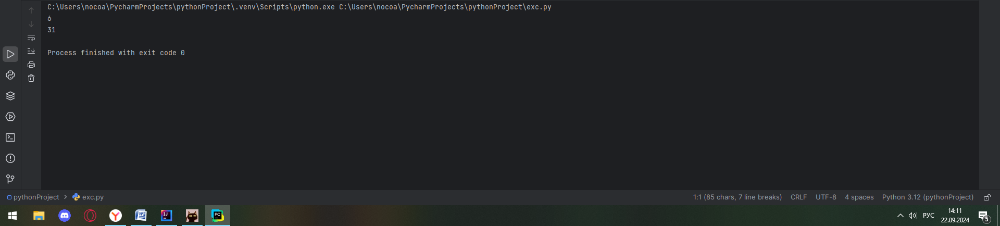
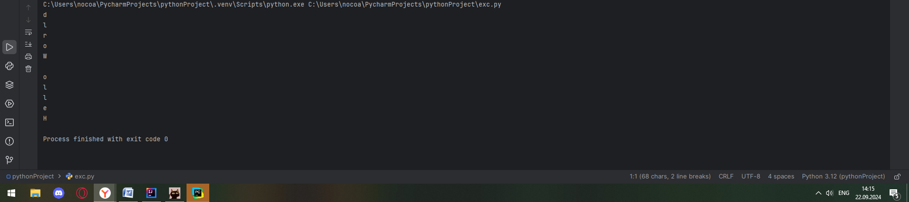

# Тема 3. Операторы, условия, циклы
Отчет по Теме #2 выполнил(а):
- Новоселов Артем Вячеславович
- АИС-22-1

| Задание | Лаб_раб | Сам_раб |
| ------ | ------ | ------ |
| Задание 1 | + | + |
| Задание 2 | + | + |
| Задание 3 | + | + |
| Задание 4 | + | + |
| Задание 5 | + | + |
| Задание 6 | + | + |
| Задание 7 | + | + |
| Задание 8 | + | + |
| Задание 9 | + | + |
| Задание 10 | + | + |

знак "+" - задание выполнено; знак "-" - задание не выполнено;

Работу проверили:
- к.э.н., доцент Панов М.А.

## Лабораторная работа № 1
### Создайте две переменные, значение которых будете вводить через консоль. Также составьте условие, в котором созданные ранее переменные будут сравниваться, если условие выполняется, то выведете в консоль «Выполняется», если нет, то «Не выполняется»
```python
one = input("Первое число")
two = input("Второе число")

if(one == two):
    print("Выполняется")
else:
    print('Не выполняется')

```
### Результаты


## Лабораторная работа № 2
### Напишите программу, которая будет определять значения переменной меньше 0, больше 0 и меньше 10 или больше 10. Это нужно реализовать при помощи одной переменной, значение которой будет вводится через консоль, а также при помощи конструкций if, elif, else
```python
one = int(input())
if (one < 0):
    print("число < 0")
elif(one > 0 and one < 10):
    print("число больше 0 и меньше 10")
else:
    print('число сильно больше 0')

```
### Результаты


## Лабораторная работа № 3
### Напишите программу, в которой будет проверяться есть ли переменная в указанном массиве используя логический оператор in. Самостоятельно посмотрите, как работает программа со значениями которых нет в массиве numbers.
```python
numbers = [11, 2, 4, 67]
number = int(input("введите число \t"));
if number in numbers:
    print(f"Число {number} есть в массиве")
else:
    print("Этого числа нет в массиве")

```
### Результаты 


## Лабораторная работа № 4
### Напишите программу, которая будет определять находится ли переменная в указанном массиве и если да, то проверьте четная она или нет. Самостоятельно протестируйте данную программу с разными значениями переменной value
```python
numbers = [11, 2, 4, 67]
value = int(input("введите число \t"));
if value in numbers:
    print(f"Число {value} есть в массиве", end = " ");
    if (value%2 ==0):
        print("и оно четное")
    else:
        print("и оно нечетное")
else:
    print("Этого числа нет в массиве")

```
### Результаты 


## Лабораторная работа № 5
### Напишите программу, в которой циклом for значения переменной i будут меняться от 0 до 10 и посмотрите, как разные виды сравнений и операций работают в цикле.
```python
for i in range(10):
    if (i == 3):
        continue
    print(f"i = {i}")
    if(i == 0 or i ==5):
        print("i равняется 0 или 5")
    elif(i in [4,5,6]):
        print("i между 4 и 6")
    if i<9:
        continue
    else:
        print("Цикл остановится")
        break

```
### Результаты 


## Лабораторная работа № 6
### Напишите программу, в которой при помощи цикла for определяется есть ли переменная value в строке string и посмотрите, как работает оператор else для циклов.
Самостоятельно посмотрите, что выведет программа, если значение переменной value оказалось в строке string.
#### Определять индекс буквы не обязательно, но если вы хотите, то это делается при помощи строки: index = string.find(value) Вы берете название переменной, в которой вы хотите что-то найти, затем применяете встроенный метод find() и в нем указываете то, что вам нужно найти. Данная строка вернет индекс искомого объекта
```python
line = "некоторые буквы"
value = input("введите символ\t")

for i in line:
    if (value == i):
        print(f"{value} есть в '{line}' (индекс = {line.find(value)})")
        break
else:
    print(f"{value} нет в '{line}'")

```
### Результаты 


## Лабораторная работа № 7
### Напишите программу, в которой вы наглядно посмотрите, как работает цикл for проходя в обратном порядке, то есть, к примеру не от 0 до 10, а от 10 до 0. В уже готовой программе показано вычитание из 100, а вам во время реализации программы будет необходимо придумать свой вариант применения обратного цикла.
```python
line = "абвгдежзийк"
for i in range(10, -1, -1):
        print(f"{i}:  " + line[i])
```
### Результаты 


## Лабораторная работа № 8
### Напишите программу используя цикл while, внутри которого есть какие-либо проверки, но быть осторожным, поскольку циклы while при неправильно написанных условиях могут становится бесконечными, как указано в примере далее.
```python
line = "абвгдежзийк"
i=0;
while True:
    if(line[i] == "и"):
        print("Следующая буква и")
        break
    else:
        print(f"{i}:    " + line[i])
        i+=1
```
### Результаты 


## Лабораторная работа № 9
### Напишите программу с использованием вложенных циклов и одной проверкой внутри них. Самое главное, не забудьте, что нельзя использовать одинаковые имена итерируемых переменных, когда вы используете вложенные циклы далее.
```python
value = 0
for i in range(10):
    for j in range(10):
        print(f"{i}  {j}:   ")
        if(i == value):
            print("i = value\n")
        elif(j == value):
            print("j = value\n")
        else:
            print("нет равентсва\n")
        if value >=10:
            value = 0
        else:
            value+=1

```
### Результаты 


## Лабораторная работа № 10
### Напишите программу с использованием flag, которое будет определять есть ли нечетное число в массиве. В данной задаче flag выступает в роли индикатора встречи нечетного числа в исходном массиве, четных чисел.
```python
flag = False
array = [0, 2, 4,6,7]

for i in array:
    if i%2 != 0:
        flag = True
if flag:
    print("В массиве есть нечетное число")
```
### Результаты 


## Самостоятельная работа № 1
### Напишите программу, которая преобразует 1 в 31. Для выполнения поставленной задачи необходимо обязательно и только один раз использовать: • Цикл for • *= 5 • += 1 Никаких других действий или циклов использовать нельзя
```python
x = 1
for i in range(10):
    x*=5
    x+=1
    print(x)
    if x==31:
        break
```
### Результаты

## Выводы

## Самостоятельная работа № 2
### Напишите программу, которая фразу «Hello World» выводит в обратном порядке, и каждая буква находится в одной строке консоли. Пример вывода в консоль:
```python
ln = "Hello World"
for i in range(len(ln)-1,-1,-1):
    print(ln[i])
```
### Результаты

## Выводы

## Самостоятельная работа № 3
### Напишите программу, на вход которой поступает значение из консоли, оно должно быть числовым и в диапазоне от 0 до 10 включительно (это необходимо учесть в программе). Если вводимое число не подходит по требованиям, то необходимо вывести оповещение об этом в консоль и остановить программу. Код должен вычислять в каком диапазоне находится полученное число. Нужно учитывать три диапазона: • от 0 до 3 включительно• от 3 до 6 • от 6 до 10 включительно Результатом работы программы будет выведенный в консоль диапазон. Программа должна занимать не более 10 строчек в редакторе кода.
```python
while True:
    n = int(input())
    if (n<0 or n>10):
        print("Не в диапозоне 0<n<10")
        continue
    elif (n>= 0 and n<=3): print("n принадлежит от 0 до 3 включительно")
    elif (n >= 3 and n <6): print("n принадлежит от 3 до 6 ")
    elif (n >= 6 and n <= 10): print("n принадлежит от 6 до 10 включительно")
    break
```
### Результаты

## Выводы

## Самостоятельная работа № 4
### Манипулирование строками. Напишите программу на Python, которая принимает предложение (на английском) в качестве входных данных от пользователя. Выполните следующие операции и отобразите результаты: • Выведите длину предложения. • Переведите предложение в нижний регистр. • Подсчитайте количество гласных (a, e, i, o, u) в предложении. • Замените все слова "ugly" на "beauty". • Проверьте, начинается ли предложение с "The" и заканчивается ли на "end". Проверьте работу программы минимум на 3 предложениях, чтобы охватить проверку всех поставленных условий
```python
def strOperation(str):
    print(f"Длинна текста: {len(str)}")
    str = str.lower()
    if(str[:3] == "the"):
        print("Предложение начинается с the")
    else:
        print("Предложение не начинается с the")
    if (str[-3:] == "end"):
        print("Предложение заканчивается на end")
    else:
        print("Предложение не заканчивается на end")
    if (" ugly " in str): str = str.replace(" ugly ", " beautiful ")
    print(str + "\n")

line = str(input())
strOperation(line)
line1 = str(input())
strOperation(line1)
line2 = str(input())
strOperation(line2)
```
### Результаты

## Выводы

## Самостоятельная работа № 5
### Составьте программу, результатом которой будет данный вывод в консоль:
!pic[pic/p3.14.1]
```python
memory = " world"
string = "hello"
values = [0,2,4,6,8,10]
counter = 0

while " world" not in string:
    memory = string
    if counter in values:
        string = string + " world"
    counter += 1
    print(string)
    if counter<10:
        string = memory
```
### Результаты

## Выводы

## Общие выводы по теме:
