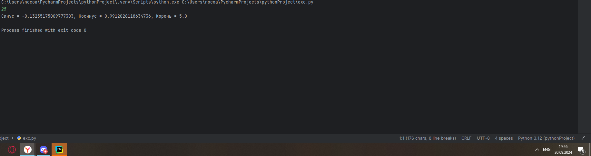
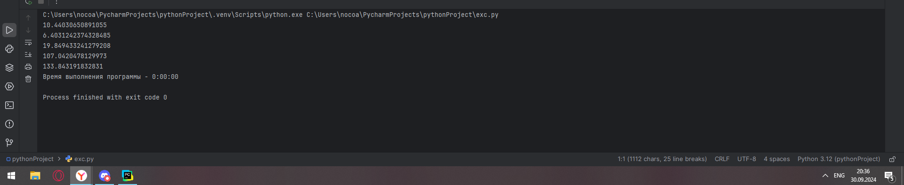
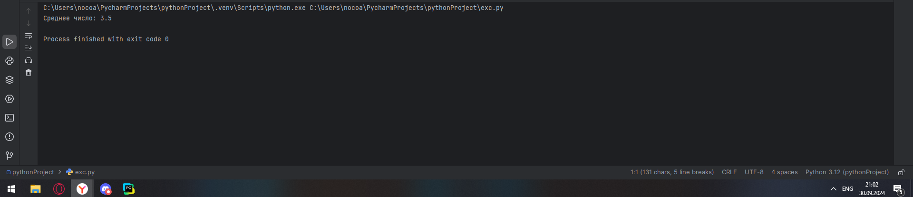
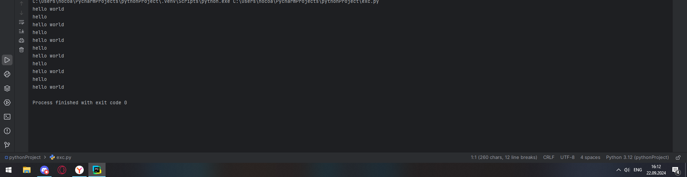

# Тема 4. ФУНКЦИИ И СТАНДАРТНЫЕ МОДУЛИ/БИБЛИОТЕКИ
Отчет по Теме #4 выполнил(а):
- Новоселов Артем Вячеславович
- АИС-22-1

| Задание | Лаб_раб | Сам_раб |
| ------ | ------ | ------ |
| Задание 1 | + | + |
| Задание 2 | + | + |
| Задание 3 | + | + |
| Задание 4 | + | + |
| Задание 5 | + | + |
| Задание 6 | + |  |
| Задание 7 | + |  |
| Задание 8 | + |  |
| Задание 9 | + |  |
| Задание 10 | + |  |

знак "+" - задание выполнено; знак "-" - задание не выполнено;

Работу проверили:
- к.э.н., доцент Панов М.А.

## Лабораторная работа № 1
### Напишите функцию, которая выполняет любые арифметические действия и выводит результат в консоль. Вызовите функцию используя “точку входа”
```python
def calc():
    print(3+2)

if __name__ == '__main__':
    calc()
```
### Результаты


## Лабораторная работа № 2
### Напишите функцию, которая выполняет любые арифметические действия, возвращает при помощи return значение в место, откуда вызывали функцию. Выведите результат в консоль. Вызовите функцию используя “точку входа”.
```python
def calc():
    return 3+2

if __name__ == '__main__':
    print(calc())

```
### Результаты


## Лабораторная работа № 3
### Напишите функцию, в которую передаются два аргумента, над ними производится арифметическое действие, результат возвращается туда, откуда эту функцию вызывали. Выведите результат в консоль. Вызовите функцию в любом небольшом цикле.
```python
def calc(a, n):
    return a+n

if __name__ == '__main__':
    for i in range(5):
        answer = calc(i, i-1)
        print(answer)
```
### Результаты 


## Лабораторная работа № 4
### Напишите функцию, на вход которой подается какое-то изначальное неизвестное количество аргументов, над которыми будет производится арифметические действия. Для выполнения задания необходимо использовать кортеж “*args”. На скриншоте ниже приведен пример такой программы с комментариями.
```python
def calc(*args):
    sumArgs = sum(args)
    print(args)
    return sumArgs

if __name__ == '__main__':
    result = calc(1,-2,13,42,5)
    print(result)
```
### Результаты 


## Лабораторная работа № 5
### Напишите функцию, которая на вход получает кортеж “**kwargs” и при помощи цикла выводит значения, поступившие в функцию.
```python
def calc(**kwargs):
    for i in kwargs:
        print(i, kwargs[i])

if __name__ == '__main__':
    result = calc(x = [1,2,3], y = [4,5,6], z = [1,1,1])

```
### Результаты 


## Лабораторная работа № 6
### Напишите две функции. Первая – получает в виде параметра “**kwargs”. Вторая считает среднее арифметическое из значений первой функции. Вызовите первую функцию используя “точку входа” и минимум 4 аргумента.
```python
def remember(**kwargs):
    for i in kwargs:
        print(f"{i}, Среднее = {average(kwargs[i])} ")
        print("\n")


def average(a):
    print(a)
    print(sum(a))
    return(sum(a)/len(a))

if __name__ == '__main__':
   remember(x = (1,2,15), y =(3,5), z = (11,11,2), z1 = (11,11,11))
```
### Результаты 


## Лабораторная работа № 7
### Создайте дополнительный файл .py. Напишите в нем любую функцию, которая будет что угодно выводить в консоль, но не вызывайте ее в нем. Откройте файл main.py, импортируйте в него функцию из нового файла и при помощи “точки входа” вызовите эту функцию.
```python
// из imp_func.py
def hello():
    print("hello world")

// из exc.py
from imp_func import hello
hello()

```
### Результаты 


## Лабораторная работа № 8
### Напишите программу, которая будет выводить корень, синус, косинус полученного от пользователя числа.
```python
from math import sin, cos, sqrt

def calc():
    a = int(input())
    print(f"Синус = {sin(a)}, Косинус = {cos(a)}, Корень = {sqrt(a)}")

if __name__ == '__main__':
    calc()

```
### Результаты 


## Лабораторная работа № 9
### Напишите программу, которая будет рассчитывать какой день недели будет через n-нное количество дней, которые укажет пользователь.далее.
```python
from datetime import datetime
from datetime import timedelta

def dayCalc():
    print(f" ДЕНЬ: {datetime.today().date()}\t" +
          f"ДЕНЬ НЕДЕЛИ:{datetime.today().isoweekday()}"
    )
    a = int(input("СКОЛЬКО ДНЕЙ ОТМОТАТЬ?\t"))
    result = datetime.today() + timedelta(days=a)
    print(f"\nЧерез {a} дней наступит {result.date()}, это {result.isoweekday()} день недели")

if __name__ == "__main__":
    dayCalc()

```
### Результаты 


## Лабораторная работа № 10
### Напишите программу с использованием flag, которое будет определять есть ли нечетное число в массиве. В данной задаче flag выступает в роли индикатора встречи нечетного числа в исходном массиве, четных чисел.
```python
global result

def calc():
    n = int(input("Введите количество углов фигуры (от 3 до 4)  "))
    global result
    if n == 3:
        a = float(input("Основание треугольника: "))
        b = float(input("Высота треугольника: "))
        result = a*b*0.5
    if n == 4:
        a = float(input("Ширина прямоугольника: "))
        b = float(input("Высота прямоугольника: "))
        result = a*b

calc()
print(result)
```
### Результаты 


## Самостоятельная работа № 1
### Дайте подробный комментарий для кода, написанного ниже. Комментарий нужен для каждой строчки кода, нужно описать что она делает. Не забудьте, что функции комментируются по-особенному.
```python
from datetime import datetime ## импорт datetime из библиотеки datetime
from math import sqrt ## импорт функции sqrt из библиотеки math

def main (**kwargs):
    """
    This function counts the hypotenuse of a triangle according to the Pythagorean theorem
    Args:
        **kwargs: 2 arguments corresponding to the lengths of the sides of the triangle
    Returns:
        void: function just prints the hypotenuse of the triangle like float value
    """
    for key in kwargs.items():
        result = sqrt(key[1][0] ** 2 + key[1][1] ** 2)
        print(result)

if __name__ == '__main__': ## "точка входа"
    start_time = datetime.now() ## переменная, хранящая временное значение, соответствующее началу работы программы
    main(                       ## использование функции main
        one=[10, 3],
        two=[5, 4],
        three=[15, 13],
        four=[93, 53],
        five=[133, 15],
    )
    time_costs = datetime.now() - start_time ## переменная, хранящая итоговое время работы программы
    print(f"Время выполнения программы - {time_costs}") ## Вывод итогового времени выполнения программы
```
### Результаты

## Выводы
Функции комментируются с помощью `"""`, с полноценным описанием ее сути, принимаемых значений и возвращаемого значения 

## Самостоятельная работа № 2
### Напишите программу, которая будет заменять игральную кость с 6 гранями. Если значение равно 5 или 6, то в консоль выводится «Вы победили», если значения 3 или 4, то вы рекурсивно должны вызвать эту же функцию, если значение 1 или 2, то в консоль выводится «Вы проиграли». При этом каждый вызов функции необходимо выводить в консоль значение “кубика”. Для выполнения задания необходимо использовать стандартную библиотеку random. Программу нужно написать, используя одну функцию и “точку входа”
```python
from random import randint

def game():
    result = randint(1, 6)
    print(f"Вам выпало: {result}")
    if result in [5,6]:
        print("Вы победили")
    elif result in [3,4]:
        game()
    else:
        print("Вы проиграли")

if __name__ == "__main__":
    game()
```
### Результаты

## Выводы
Рекурсивные функции должны иметь исчерпывающее условие, иначе может войти в вечный цикл рекурсии

## Самостоятельная работа № 3
### Напишите программу, которая будет выводить текущее время, с точностью до секунд на протяжении 5 секунд. Программу нужно написать с использованием цикла. Подсказка: необходимо использовать модуль datetime и time, а также вам необходимо как-то “усыплять” программу на 1 секунду.
```python
from datetime import datetime
import time
def counter():
    for i in range(1, 6):
        print(i)
        print(datetime.today().time().strftime("%H:%M:%S"))
        time.sleep(1)

if __name__ == "__main__":
    counter()
```
### Результаты

## Выводы
`time` имеет функцию `sleep`, которая позволяет "усыпить" цикл на необходимое время

## Самостоятельная работа № 4
### Напишите программу, которая считает среднее арифметическое от аргументов вызываемое функции, с условием того, что изначальное количество этих аргументов неизвестно. Программу необходимо реализовать используя одну функцию и “точку входа”
```python

def counter(*args):
    print(f"Среднее число: {sum(args)/float(len(args))}")

if __name__ == "__main__":
    counter(1,2,3,4,5,6)
```
### Результаты

## Выводы
`*args` позволяет указать программе на возможность использования в функции кортежей неопределеннной длины

## Самостоятельная работа № 5
### Создайте два Python файла, в одном будет выполняться вычисление площади треугольника при помощи формулы Герона (необходимо реализовать через функцию), а во втором будет происходить взаимодействие с пользователем (получение всей необходимой информации и вывод результатов). Напишите эту программу и выведите в консоль полученную площадь.

```python
## Основной файл
from geron import geron
from asker import ask

if __name__ == '__main__':
    data = ask()
    print(f"Площадь по формуле Герона ={geron(data)} ")

##  Файл взаимодействия asker.py
def ask():
     a = float(input("Перавя сторона"))
     b = float(input("Вторая сторона"))
     c = float(input("Третья сторона"))
     result = ((a+b+c)/2, a, b, c)
     return result

##  Файл с Героном geron.py
from math import sqrt
def geron(args):
    print(args)
    p, a, b, c = args[0], args[1], args[2], args[3]
    return sqrt(p*(p-a)*(p-b)*(p-c))
```
### Результаты

## Выводы
Python позволяет использовать функции из других .py файлов, что делает написание кода проще и удобнее для дальнейшего развития программы

## Общие выводы по теме:
Функции в python объявляются с помощью `def название_функции: тело функции`. Во многом они схожи с функциями других высокоуровневых языков.
