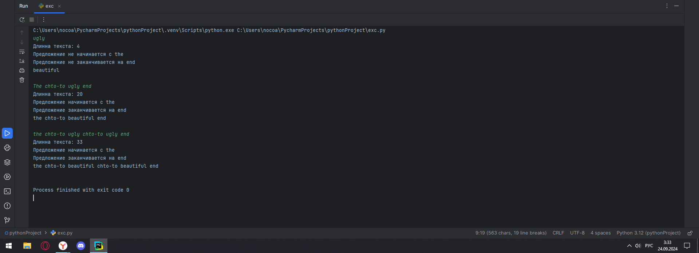

# Тема 4. ФУНКЦИИ И СТАНДАРТНЫЕ МОДУЛИ/БИБЛИОТЕКИ
Отчет по Теме #4 выполнил(а):
- Новоселов Артем Вячеславович
- АИС-22-1

| Задание | Лаб_раб | Сам_раб |
| ------ | ------ | ------ |
| Задание 1 | + | + |
| Задание 2 | + | + |
| Задание 3 | + | + |
| Задание 4 | + | + |
| Задание 5 | + | + |
| Задание 6 | + |  |
| Задание 7 | + |  |
| Задание 8 | + |  |
| Задание 9 | + |  |
| Задание 10 | + |  |

знак "+" - задание выполнено; знак "-" - задание не выполнено;

Работу проверили:
- к.э.н., доцент Панов М.А.

## Лабораторная работа № 1
### Напишите функцию, которая выполняет любые арифметические действия и выводит результат в консоль. Вызовите функцию используя “точку входа”
```python
def calc():
    print(3+2)

if __name__ == '__main__':
    calc()
```
### Результаты


## Лабораторная работа № 2
### Напишите функцию, которая выполняет любые арифметические действия, возвращает при помощи return значение в место, откуда вызывали функцию. Выведите результат в консоль. Вызовите функцию используя “точку входа”.
```python
def calc():
    return 3+2

if __name__ == '__main__':
    print(calc())

```
### Результаты


## Лабораторная работа № 3
### Напишите функцию, в которую передаются два аргумента, над ними производится арифметическое действие, результат возвращается туда, откуда эту функцию вызывали. Выведите результат в консоль. Вызовите функцию в любом небольшом цикле.
```python
def calc(a, n):
    return a+n

if __name__ == '__main__':
    for i in range(5):
        answer = calc(i, i-1)
        print(answer)
```
### Результаты 


## Лабораторная работа № 4
### Напишите функцию, на вход которой подается какое-то изначальное неизвестное количество аргументов, над которыми будет производится арифметические действия. Для выполнения задания необходимо использовать кортеж “*args”. На скриншоте ниже приведен пример такой программы с комментариями.
```python
def calc(*args):
    sumArgs = sum(args)
    print(args)
    return sumArgs

if __name__ == '__main__':
    result = calc(1,-2,13,42,5)
    print(result)
```
### Результаты 


## Лабораторная работа № 5
### Напишите функцию, которая на вход получает кортеж “**kwargs” и при помощи цикла выводит значения, поступившие в функцию.
```python
def calc(**kwargs):
    for i in kwargs:
        print(i, kwargs[i])

if __name__ == '__main__':
    result = calc(x = [1,2,3], y = [4,5,6], z = [1,1,1])

```
### Результаты 


## Лабораторная работа № 6
### Напишите две функции. Первая – получает в виде параметра “**kwargs”. Вторая считает среднее арифметическое из значений первой функции. Вызовите первую функцию используя “точку входа” и минимум 4 аргумента.
```python
def remember(**kwargs):
    for i in kwargs:
        print(f"{i}, Среднее = {average(kwargs[i])} ")
        print("\n")


def average(a):
    print(a)
    print(sum(a))
    return(sum(a)/len(a))

if __name__ == '__main__':
   remember(x = (1,2,15), y =(3,5), z = (11,11,2), z1 = (11,11,11))
```
### Результаты 


## Лабораторная работа № 7
### Создайте дополнительный файл .py. Напишите в нем любую функцию, которая будет что угодно выводить в консоль, но не вызывайте ее в нем. Откройте файл main.py, импортируйте в него функцию из нового файла и при помощи “точки входа” вызовите эту функцию.
```python
// из imp_func.py
def hello():
    print("hello world")

// из exc.py
from imp_func import hello
hello()

```
### Результаты 


## Лабораторная работа № 8
### Напишите программу, которая будет выводить корень, синус, косинус полученного от пользователя числа.
```python
from math import sin, cos, sqrt

def calc():
    a = int(input())
    print(f"Синус = {sin(a)}, Косинус = {cos(a)}, Корень = {sqrt(a)}")

if __name__ == '__main__':
    calc()

```
### Результаты 


## Лабораторная работа № 9
### Напишите программу, которая будет рассчитывать какой день недели будет через n-нное количество дней, которые укажет пользователь.далее.
```python
from datetime import datetime
from datetime import timedelta

def dayCalc():
    print(f" ДЕНЬ: {datetime.today().date()}\t" +
          f"ДЕНЬ НЕДЕЛИ:{datetime.today().isoweekday()}"
    )
    a = int(input("СКОЛЬКО ДНЕЙ ОТМОТАТЬ?\t"))
    result = datetime.today() + timedelta(days=a)
    print(f"\nЧерез {a} дней наступит {result.date()}, это {result.isoweekday()} день недели")

if __name__ == "__main__":
    dayCalc()

```
### Результаты 


## Лабораторная работа № 10
### Напишите программу с использованием flag, которое будет определять есть ли нечетное число в массиве. В данной задаче flag выступает в роли индикатора встречи нечетного числа в исходном массиве, четных чисел.
```python
global result

def calc():
    n = int(input("Введите количество углов фигуры (от 3 до 4)  "))
    global result
    if n == 3:
        a = float(input("Основание треугольника: "))
        b = float(input("Высота треугольника: "))
        result = a*b*0.5
    if n == 4:
        a = float(input("Ширина прямоугольника: "))
        b = float(input("Высота прямоугольника: "))
        result = a*b

calc()
print(result)
```
### Результаты 


## Самостоятельная работа № 1
### Напишите программу, которая преобразует 1 в 31. Для выполнения поставленной задачи необходимо обязательно и только один раз использовать: • Цикл for • *= 5 • += 1 Никаких других действий или циклов использовать нельзя
```python
x = 1
for i in range(10):
    x*=5
    x+=1
    print(x)
    if x==31:
        break
```
### Результаты

## Выводы
### Цикл `for` позволяет перебирать числовой диапозон с помощью конструкции `for [переменная] in range(числовой диапозон)` 

## Самостоятельная работа № 2
### Напишите программу, которая фразу «Hello World» выводит в обратном порядке, и каждая буква находится в одной строке консоли. Пример вывода в консоль:
```python
ln = "Hello World"
for i in range(len(ln)-1,-1,-1):
    print(ln[i])
```
### Результаты

## Выводы
Цикл `for` позволяет перебирать строки

## Самостоятельная работа № 3
### Напишите программу, на вход которой поступает значение из консоли, оно должно быть числовым и в диапазоне от 0 до 10 включительно (это необходимо учесть в программе). Если вводимое число не подходит по требованиям, то необходимо вывести оповещение об этом в консоль и остановить программу. Код должен вычислять в каком диапазоне находится полученное число. Нужно учитывать три диапазона: • от 0 до 3 включительно• от 3 до 6 • от 6 до 10 включительно Результатом работы программы будет выведенный в консоль диапазон. Программа должна занимать не более 10 строчек в редакторе кода.
```python
while True:
    n = int(input())
    if (n<0 or n>10):
        print("Не в диапозоне 0<n<10")
        continue
    elif (n>= 0 and n<=3): print("n принадлежит от 0 до 3 включительно")
    elif (n >= 3 and n <6): print("n принадлежит от 3 до 6 ")
    elif (n >= 6 and n <= 10): print("n принадлежит от 6 до 10 включительно")
    break
```
### Результаты

## Выводы
`continue` позволяет перейти к следующей иттерации цикла, `break` - выйти из цикла

## Самостоятельная работа № 4
### Манипулирование строками. Напишите программу на Python, которая принимает предложение (на английском) в качестве входных данных от пользователя. Выполните следующие операции и отобразите результаты: • Выведите длину предложения. • Переведите предложение в нижний регистр. • Подсчитайте количество гласных (a, e, i, o, u) в предложении. • Замените все слова "ugly" на "beauty". • Проверьте, начинается ли предложение с "The" и заканчивается ли на "end". Проверьте работу программы минимум на 3 предложениях, чтобы охватить проверку всех поставленных условий
```python
def strOperation(str):
    print(f"Длинна текста: {len(str)}")
    str = str.lower()
    if(str[:3] == "the"):
        print("Предложение начинается с the")
    else:
        print("Предложение не начинается с the")
    if (str[-3:] == "end"):
        print("Предложение заканчивается на end")
    else:
        print("Предложение не заканчивается на end")
    if ("ugly" in str): str = str.replace("ugly", "beautiful")
    print(str + "\n")

line = str(input())
strOperation(line)
line1 = str(input())
strOperation(line1)
line2 = str(input())
strOperation(line2)
```
### Результаты

## Выводы
1. `str.replace("аргумент 1", "аршумент 2")` - позволяет заменить определенную последовательность символов в строке на другую
2. Для повторного пременения определенных одинаковых операций удобнее всего использовать функции. В python они прописываются с помощью `def` 

## Самостоятельная работа № 5
### Составьте программу, результатом которой будет данный вывод в консоль:
!pic[pic/p3.14.1]
```python
memory = " world"
string = "hello"
values = [0,2,4,6,8,10]
counter = 0

while " world" not in string:
    memory = string
    if counter in values:
        string = string + " world"
    counter += 1
    print(string)
    if counter<10:
        string = memory
```
### Результаты

## Выводы
Цикл `while` позволяет проверить соответствие условию состояние строки

## Общие выводы по теме:
Циклы `for` и `while` в python во многом идентичны циклам других высокоуровневых языков. При работе с ними наиболее очевидна важность соблюдения `Tab`-уляции при работе в Python. 
