# Тема 5. Базовые коллекции: множества, списки
Отчет по Теме #5 выполнил(а):
- Новоселов Артем Вячеславович
- АИС-22-1

| Задание | Лаб_раб | Сам_раб |
| ------ | ------ | ------ |
| Задание 1 | + | + |
| Задание 2 | + | + |
| Задание 3 | + | + |
| Задание 4 | + | + |
| Задание 5 | + | + |
| Задание 6 | + |  |
| Задание 7 | + |  |
| Задание 8 | + |  |
| Задание 9 | + |  |
| Задание 10 | + |  |

знак "+" - задание выполнено; знак "-" - задание не выполнено;

Работу проверили:
- к.э.н., доцент Панов М.А.

## Лабораторная работа № 1
### На вход программы поступает два множества, а ваша задача вывести все элементы первого, которых нет во втором
```python
set1 = set([1,2,3])
set2= set([1,2,4,5,6])
set4 = set1-set2
print(set4)
```
### Результаты
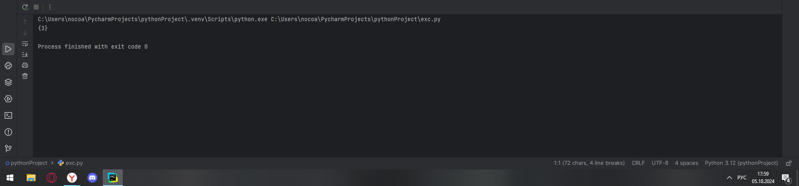


## Лабораторная работа № 2
### Напишите две одинаковые программы, только одна будет использовать set(), а вторая frozenset() и попробуйте к исходному множеству добавить несколько элементов, например, через цикл
```python
set1 = set([1,2,3])

for i in range(4, 8):
    set1.add(i)
print(set1)
set2 = frozenset([1,2,3])
for i in range(4, 8):
    set2.add(i)
print(set2)

```
### Результаты
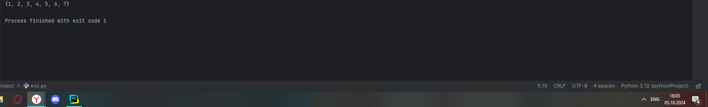
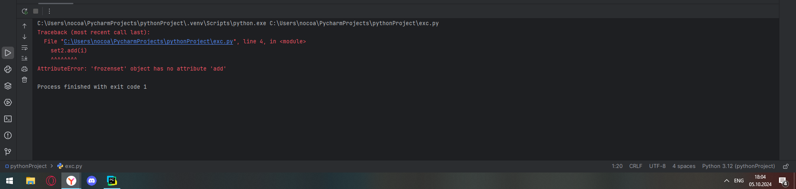


## Лабораторная работа № 3
### На вход в программу поступает список (минимальной длиной 2 символа). Напишите программу, которая будет менять первый и последний элемент списка
```python
list1 = input('Введите символы через пробел\n').split()
list1[0], list1[-1] = list1[-1], list1[0]
print(list1, "Программа меняет первый и последний символ местами")
```
### Результаты 
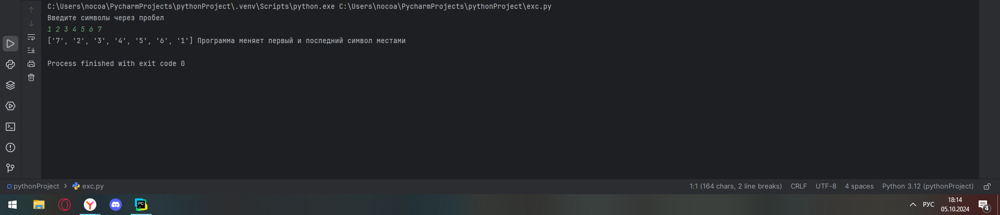


## Лабораторная работа № 4
### На вход в программу поступает список (минимальной длиной 10 символов). Напишите программу, которая выводит элементы с индексами от 2 до 6. В программе необходимо использовать “срез”
```python
while True:
    list1 = input('Введите символы через пробел (не менее 10)\n').split()
    if len(list1)>=10:
        break
print(list1[2:7])
```
### Результаты 
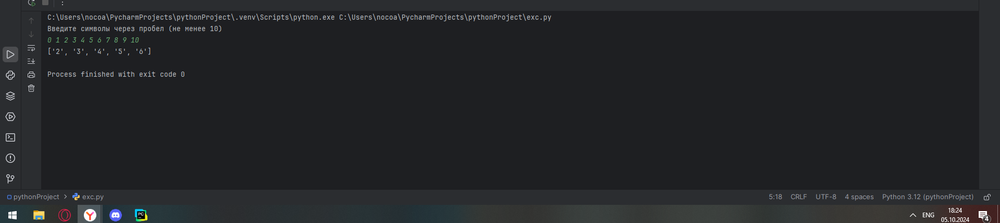

## Лабораторная работа № 5
### Суть поиска в следующем: он берет произвольный список чисел, находит самое большое из них, а затем делит его на длину списка. Студент пока не придумал, где может пригодиться подобное значение, но ищет у вас помощи в реализации такой функции useless().
```python
def useless(list1):
    return max(list1)/len(list1)

my_list = [1,2,3,4,10]
print(useless(my_list))
```
### Результаты 
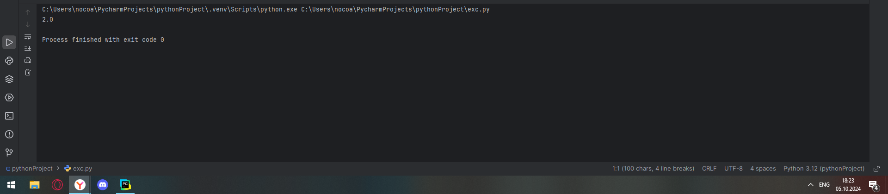

## Лабораторная работа № 6
### Ребята не могут определится каким супергероем они хотят стать. У них есть случайно составленный список супергероев, и вы должны определить кто из ребят будет каким супергероем. Необходимо использовать разделение списков
```python
superheroes = ['spiderman', 'batman', 'fleh']
andrei, ivan, alexei = superheroes

print(f"andrei {andrei}, ivan {ivan}, alexei {alexei}")
```
### Результаты 
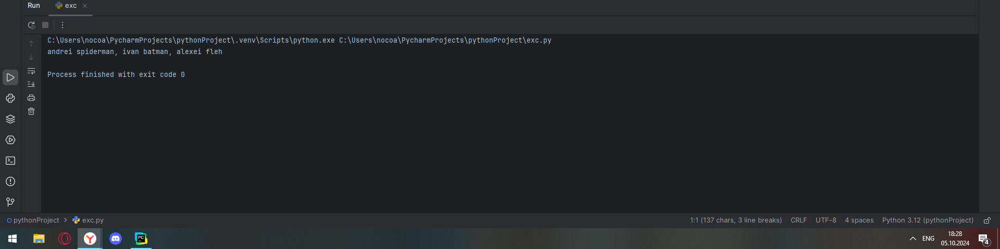

## Лабораторная работа № 7
### Вовочка, насмотревшись передачи “Слабое звено” решил написать программу, которая также будет находить самое слабое звено (минимальный элемент) и удалять его, только делать он это хочет не с людьми, а со списком. Помогите Вовочке с реализацией программы. Подсказка: для этого вам необходимо отсортировать список и удалить значение при помощи pop()
```python
list1 = [1,2,3,4,5,6,7,8,9,0,10,-10,30,60, -1]
list1.sort(reverse=True)
list1.pop()
print(list1)
```
### Результаты 
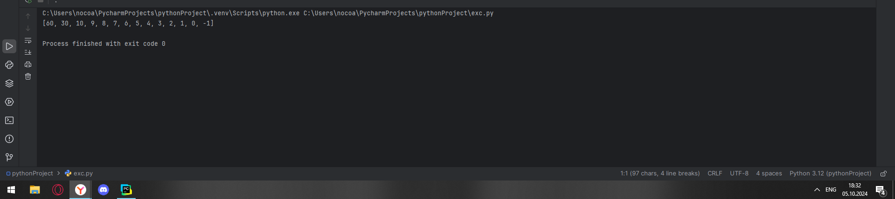

## Лабораторная работа № 8
### Михаил решил создать большой n-мерный список, для этого он случайным образом создал несколько списков, состоящих минимум из 3, а максимум из 10 элементов и поместил их в один большой список. Он также как и Иван не знает зачем ему это сейчас нужно, но надеется на то, что это пригодится ему в будущем
```python
from random import randint
n = int(input("Введите размерность списка списков\n"))
main_list = []
for i in range(n):
    y = randint(3, 10)
    list1 = []
    for j in range(y):
        list1.append(randint(1, 100))
        if (j == y-1):
            main_list.append(list1)
    print(list1)
print(f"\nСписок списков:\n {main_list}")
```
### Результаты 


## Лабораторная работа № 9
### Вы работаете в ресторане и отвечаете за статистику покупок, ваша задача сравнить между собой заказы покупателей, которые указаны в разном порядке. Реализуйте функцию superset(), которая принимает 2 множества. Результат работы функции: вывод в консоль одного из сообщений в зависимости от ситуации: 1 - «Супермножество не обнаружено» 2 – «Объект {X} является чистым супермножеством» 3 – «Множества равны.
```python
def superset(set1, set2):
    if set1 == set2:
        print("множества равны")
    elif((set1<set2) or (set1>set2)):
        set3 = max(set1,set2)
        print(f"Супермножество {set3} обнаружено")
    else:
        print("Супермножества нет")

superset({1,2,3,4,5,6}, {5,6})
superset({5,6}, {1,2,3,4,5,6})
superset({1,2}, {5,6})
superset({2,3,4}, {2,3,4})
```
### Результаты 
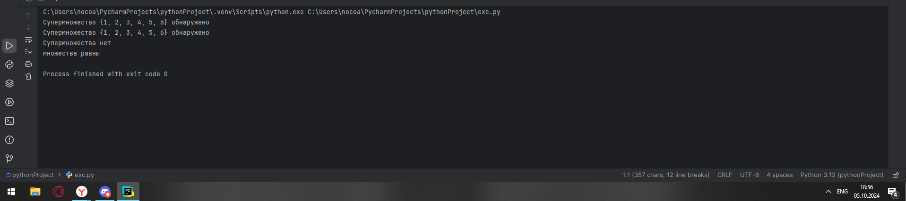

## Лабораторная работа № 10
### Предположим, что вам нужно разобрать стопку бумаг, но нужно начать работу с нижней, “переверните стопку”. Вам дан произвольный список. Представьте его в обратном порядке. Программа должна занимать не более двух строк в редакторе кода.
```python
list1 = [1,2,3,4,5,6,7]
print(list1[::-1])
```
### Результаты 
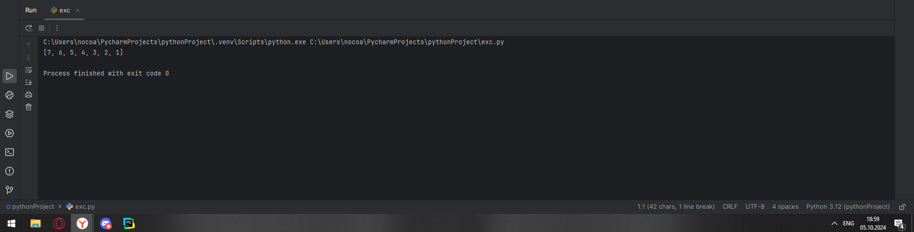

## Самостоятельная работа № 1
### Ресторан на предприятии ведет учет посещений за неделю при помощи кода работника. У них есть список со всеми посещениями за неделю. Ваша задача почитать: • Сколько было выдано чеков • Сколько разных людей посетило ресторан • Какой работник посетил ресторан больше всех раз Список выданных чеков за неделю: [8734, 2345, 8201, 6621, 9999, 1234, 5678, 8201, 8888, 4321, 3365, 1478, 9865, 5555, 7777, 9998, 1111, 2222, 3333, 4444, 5556, 6666, 5410, 7778, 8889, 4445, 1439, 9604, 8201, 3365, 7502, 3016, 4928, 5837, 8201, 2643, 5017, 9682, 8530, 3250, 7193, 9051, 4506, 1987, 3365, 5410, 7168, 7777, 9865, 5678, 8201, 4445, 3016, 4506, 4506]
Результатом выполнения задачи будет: листинг кода, и вывод в консоль, в котором будет указана вся необходимая информация.
```python
check_list = [8734, 2345, 8201, 6621, 9999, 1234, 5678, 8201, 8888, 4321, 3365, 1478, 9865, 5555, 7777, 9998, 1111, 2222, 3333, 4444, 5556, 6666, 5410, 7778, 8889, 4445, 1439, 9604, 8201, 3365, 7502, 3016, 4928, 5837, 8201, 2643, 5017, 9682, 8530, 3250, 7193, 9051, 4506, 1987, 3365, 5410, 7168, 7777, 9865, 5678, 8201, 4445, 3016, 4506, 4506]
print(check_list)
set_check = set(check_list)
print(set_check)
pos = 0 ## Переменная, сохраняющая номер чека с максиммальным кол-вом посещений
counter = 0 ## Переменная, сохраняющая максиммальное кол-во посещений
for i in set_check:
    innerPos = i ## Переменная, с текущим номером чека
    innerCounter = check_list.count(i) ## Переменная, с количеством посищений определенного чека
    if counter<innerCounter: ## сравнение текущего кол-ва посещений и максимального сохраненного
        pos = innerPos
        counter = innerCounter
print(f"Количество чеков: {len(check_list)}")
print(f"Количество Уникальных чеков: {len(set_check)}")
print(f"Самый частый посетитель: {pos}, {counter} раз")
```
### Результаты
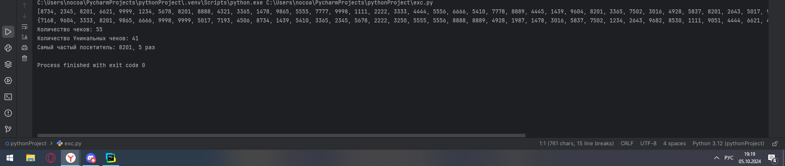
## Выводы
1) `set_check = set(check_list)`: С помощью функции `set()` можно создать множество (набор неповторяющихся значений) из списка
2) `len(check_list)`, `len(set_check)`: длины исходного списка и множества с уникальными значениями

## Самостоятельная работа № 2
### На физкультуре студенты сдавали бег, у преподавателя физкультуры есть список всех результатов, ему нужно узнать • Три лучшие результата • Три худшие результата • Все результаты начиная с 10 Ваша задача помочь ему в этом. Список результатов бега: [10.2, 14.8, 19.3, 22.7, 12.5, 33.1, 38.9, 21.6, 26.4, 17.1, 30.2, 35.7, 16.9, 27.8, 24.5, 16.3, 18.7, 31.9, 12.9, 37.4] Результатом выполнения задачи буде
```python
result_list = [10.2, 14.8, 19.3, 22.7, 12.5, 33.1, 38.9, 21.6, 26.4, 17.1, 30.2, 35.7, 16.9, 27.8, 24.5, 16.3, 18.7, 31.9, 12.9, 37.4]
result_list.sort() ## сортировка массива
print(f"Лучшие результаты: {result_list[:3]}, " ## Вывод результатов
      f"\nХудшие результаты: {result_list[:-4:-1]}, "
      f"\nРезультаты с 10 места: {result_list[10:]}")
```
### Результаты
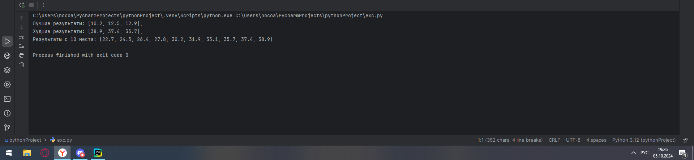
## Выводы
1) Метод `sort` позволяет отстортировать необходимый список (2 строка).
2) `result_list[:3]` выводит первые 3 элемента отсторитрованного массива
3) `result_list[:-4:-1]` выводит последние 3 элемента отсторитрованного массива, начиная с конца
4) `result_list[10:]` позволяет вывести все результаты, начиная с 10 места  

## Самостоятельная работа № 3
### Преподаватель по математике придумал странную задачку. У вас есть три списка с элементами, каждый элемент которых – длина стороны треугольника, ваша задача найти площади двух треугольников, составленные из максимальных и минимальных элементов полученных списков. Результатом выполнения задачи будет: листинг кода, и вывод в консоль, в котором будут указаны два этих значения.
one = [12, 25, 3, 48, 71], two = [5, 18, 40, 62, 98], three = [4, 21, 37, 56, 84]
```python
from math import sqrt

one = [12, 25, 3, 48, 71]
two = [5, 18, 40, 62, 98]
three = [4, 21, 37, 56, 84]

max_tr = [max(one), max(two), max(three)] ## Создание максиамльного треугольника
min_tr = [min(one), min(two), min(three)] ## Создание минимального треугольника
max_per = sum(max_tr)/2 ## Полупериметр максиамльного треугольника
min_per = sum(min_tr)/2 ## Полупериметр минимального треугольника
max_plosh = sqrt(max_per * (max_per - max_tr[0])*(max_per - max_tr[1]) * (max_per - max_tr[2])) ## Площадь по теореме Герона
min_plosh = sqrt(min_per * (min_per - min_tr[0])*(min_per - min_tr[1]) * (min_per - min_tr[2]))
print(f"Максимальная площадь {max_plosh}, Минимальная площадь {min_plosh}")
```
### Результаты
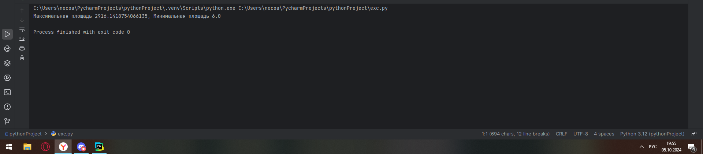
## Выводы
1) `from math import sqrt` Импорт метода `sqrt` для теоремы Герона
2) `max(one)`, `min(one)` Минимальные и максимальные значения из списков
3) `sqrt(max_per * (max_per - max_tr[0])*(max_per - max_tr[1]) * (max_per - max_tr[2]))` Теорема Герона

## Самостоятельная работа № 4
### Никто не любит получать плохие оценки, поэтому Борис решил это исправить. Допустим, что все оценки студента за семестр хранятся в одном списке. Ваша задача удалить из этого списка все двойки, а все тройки заменить на четверки. Списки оценок (проверить работу программы на всех трех вариантах):
[2, 3, 4, 5, 3, 4, 5, 2, 2, 5, 3, 4, 3, 5, 4] 
[4, 2, 3, 5, 3, 5, 4, 2, 2, 5, 4, 3, 5, 3, 4] 
[5, 4, 3, 3, 4, 3, 3, 5, 5, 3, 3, 3, 3, 4, 4]
Результатом выполнения задачи будет: листинг кода, и вывод в консоль, в котором будут три обновленных массива
```python
first = [2, 3, 4, 5, 3, 4, 5, 2, 2, 5, 3, 4, 3, 5, 4]
second = [4, 2, 3, 5, 3, 5, 4, 2, 2, 5, 4, 3, 5, 3, 4]
third = [5, 4, 3, 3, 4, 3, 3, 5, 5, 3, 3, 3, 3, 4, 4]

def markChanger(list1):
    while 2 in list1:
        list1.remove(2)
    while 3 in list1:
        list1[list1.index(3)] = 4
    print(list1)

markChanger(first)
markChanger(second)
markChanger(third)
```
### Результаты
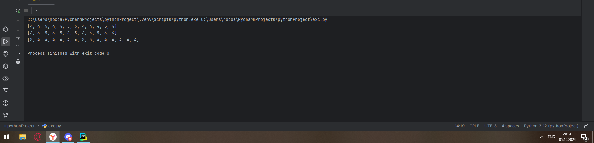
## Выводы
1) `list1.remove(2)` удаляет первую попавшуюся 2
2) ` list1.index(3)` позволяет найти индекс первой 3 в списке

## Самостоятельная работа № 5
### Вам предоставлены списки натуральных чисел, из них необходимо сформировать множества. При этом следует соблюдать это правило: если какое-либо число повторяется, то преобразовать его в строку по следующему образцу: например, если число 4 повторяется 3 раза, то в множестве будет следующая запись: само число 4, строка «44», строка «444».
list_1 = [1, 1, 3, 3, 1] list_2 = [5, 5, 5, 5, 5, 5, 5] list_3 = [2, 2, 1, 2, 2, 5, 6, 7, 1, 3, 2, 2]
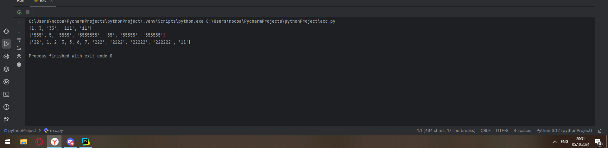
```python
list_11 = [1, 1, 3, 3, 1]
list_2 = [5, 5, 5, 5, 5, 5, 5]
list_3 = [2, 2, 1, 2, 2, 5, 6, 7, 1, 3, 2, 2]

def setMaker(list1):
    set1 = set()
    for i in range(len(list1)):
        if list1[i] not in set1:
            set1.add(list1[i])
        else:
            count = list1.count(list1[i])
            while count != 1:
                set1.add(str(list1[i]) * count)
                count-=1
    print(set1)
setMaker(list_11)
setMaker(list_2)
setMaker(list_3)
```
### Результаты

## Выводы
1) Метод `count` позволяет найти в списке необходимый элемент 
2) Множества могут хранить в себе элементы разных типов, как и списки

## Общие выводы по теме:
Списки и множества задаются в Python с помощью соответсвтующих функций `list()` и `set()`, а также благодаря () и {}.
Оба типа данных могут содержать в себе разные типы данных одновременно. Списки в отличии от множеств могут содеражать идентичные элементы. Также элементы в списках имеют соответсвубщие индексы, в отличии от множеств 
