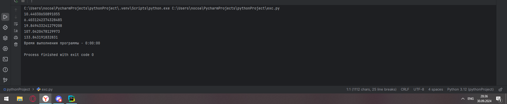
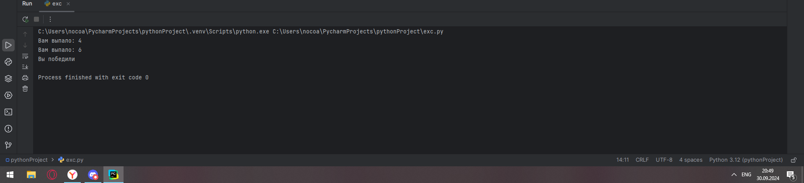
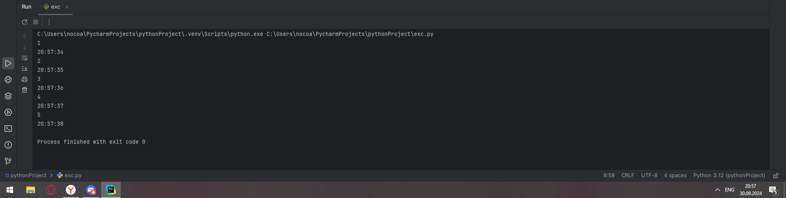
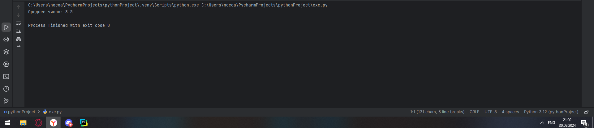
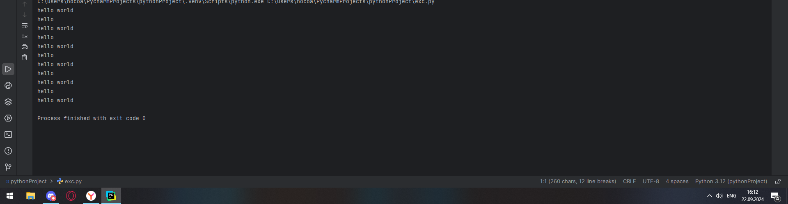
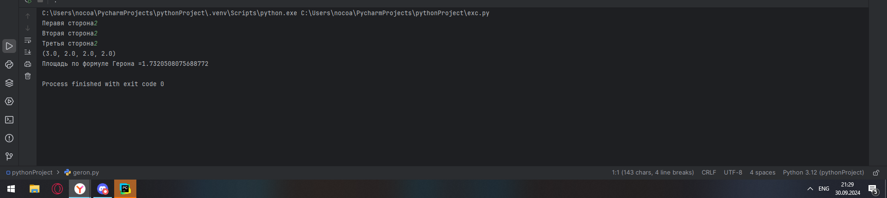

# Тема 5. Базовые коллекции: множества, списки
Отчет по Теме #5 выполнил(а):
- Новоселов Артем Вячеславович
- АИС-22-1

| Задание | Лаб_раб | Сам_раб |
| ------ | ------ | ------ |
| Задание 1 | + | + |
| Задание 2 | + | + |
| Задание 3 | + | + |
| Задание 4 | + | + |
| Задание 5 | + | + |
| Задание 6 | + |  |
| Задание 7 | + |  |
| Задание 8 | + |  |
| Задание 9 | + |  |
| Задание 10 | + |  |

знак "+" - задание выполнено; знак "-" - задание не выполнено;

Работу проверили:
- к.э.н., доцент Панов М.А.

## Лабораторная работа № 1
### На вход программы поступает два множества, а ваша задача вывести все элементы первого, которых нет во втором
```python
set1 = set([1,2,3])
set2= set([1,2,4,5,6])
set4 = set1-set2
print(set4)
```
### Результаты


## Лабораторная работа № 2
### Напишите две одинаковые программы, только одна будет использовать set(), а вторая frozenset() и попробуйте к исходному множеству добавить несколько элементов, например, через цикл
```python
set1 = set([1,2,3])

for i in range(4, 8):
    set1.add(i)
print(set1)
set2 = frozenset([1,2,3])
for i in range(4, 8):
    set2.add(i)
print(set2)

```
### Результаты


## Лабораторная работа № 3
### На вход в программу поступает список (минимальной длиной 2 символа). Напишите программу, которая будет менять первый и последний элемент списка
```python
list1 = input('Введите символы через пробел\n').split()
list1[0], list1[-1] = list1[-1], list1[0]
print(list1, "Программа меняет первый и последний символ местами")
```
### Результаты 


## Лабораторная работа № 4
### На вход в программу поступает список (минимальной длиной 10 символов). Напишите программу, которая выводит элементы с индексами от 2 до 6. В программе необходимо использовать “срез”
```python
while True:
    list1 = input('Введите символы через пробел (не менее 10)\n').split()
    if len(list1)>=10:
        break
print(list1[2:7])
```
### Результаты 


## Лабораторная работа № 5
### Суть поиска в следующем: он берет произвольный список чисел, находит самое большое из них, а затем делит его на длину списка. Студент пока не придумал, где может пригодиться подобное значение, но ищет у вас помощи в реализации такой функции useless().
```python
def useless(list1):
    return max(list1)/len(list1)

my_list = [1,2,3,4,10]
print(useless(my_list))
```
### Результаты 


## Лабораторная работа № 6
### Ребята не могут определится каким супергероем они хотят стать. У них есть случайно составленный список супергероев, и вы должны определить кто из ребят будет каким супергероем. Необходимо использовать разделение списков
```python
superheroes = ['spiderman', 'batman', 'fleh']
andrei, ivan, alexei = superheroes

print(f"andrei {andrei}, ivan {ivan}, alexei {alexei}")
```
### Результаты 


## Лабораторная работа № 7
### Вовочка, насмотревшись передачи “Слабое звено” решил написать программу, которая также будет находить самое слабое звено (минимальный элемент) и удалять его, только делать он это хочет не с людьми, а со списком. Помогите Вовочке с реализацией программы. Подсказка: для этого вам необходимо отсортировать список и удалить значение при помощи pop()
```python
list1 = [1,2,3,4,5,6,7,8,9,0,10,-10,30,60, -1]
list1.sort(reverse=True)
list1.pop()
print(list1)
```
### Результаты 


## Лабораторная работа № 8
### Михаил решил создать большой n-мерный список, для этого он случайным образом создал несколько списков, состоящих минимум из 3, а максимум из 10 элементов и поместил их в один большой список. Он также как и Иван не знает зачем ему это сейчас нужно, но надеется на то, что это пригодится ему в будущем
```python
from random import randint
n = int(input("Введите размерность списка списков\n"))
main_list = []
for i in range(n):
    y = randint(3, 10)
    list1 = []
    for j in range(y):
        list1.append(randint(1, 100))
        if (j == y-1):
            main_list.append(list1)
    print(list1)
print(f"\nСписок списков:\n {main_list}")
```
### Результаты 


## Лабораторная работа № 9
### Вы работаете в ресторане и отвечаете за статистику покупок, ваша задача сравнить между собой заказы покупателей, которые указаны в разном порядке. Реализуйте функцию superset(), которая принимает 2 множества. Результат работы функции: вывод в консоль одного из сообщений в зависимости от ситуации: 1 - «Супермножество не обнаружено» 2 – «Объект {X} является чистым супермножеством» 3 – «Множества равны.
```python
def superset(set1, set2):
    if set1 == set2:
        print("множества равны")
    elif((set1<set2) or (set1>set2)):
        set3 = max(set1,set2)
        print(f"Супермножество {set3} обнаружено")
    else:
        print("Супермножества нет")

superset({1,2,3,4,5,6}, {5,6})
superset({5,6}, {1,2,3,4,5,6})
superset({1,2}, {5,6})
superset({2,3,4}, {2,3,4})
```
### Результаты 


## Лабораторная работа № 10
### Предположим, что вам нужно разобрать стопку бумаг, но нужно начать работу с нижней, “переверните стопку”. Вам дан произвольный список. Представьте его в обратном порядке. Программа должна занимать не более двух строк в редакторе кода.
```python
list1 = [1,2,3,4,5,6,7]
print(list1[::-1])
```
### Результаты 


## Самостоятельная работа № 1
### Дайте подробный комментарий для кода, написанного ниже. Комментарий нужен для каждой строчки кода, нужно описать что она делает. Не забудьте, что функции комментируются по-особенному.
```python
from datetime import datetime ## импорт datetime из библиотеки datetime
from math import sqrt ## импорт функции sqrt из библиотеки math

def main (**kwargs):
    """
    Эта функция считает площадь треугольника по теореме Пифагора
    Args:
        **kwargs: принимает аргументы, соответствующие длинам катетов треугольника (может принимать сколько угодно аргументов)
    Returns:
        void: функция выводит в консоль полученную площадь
    """
    for key in kwargs.items():
        result = sqrt(key[1][0] ** 2 + key[1][1] ** 2)
        print(result)

if __name__ == '__main__': ## "точка входа"
    start_time = datetime.now() ## переменная, хранящая временное значение, соответствующее началу работы программы
    main(                       ## использование функции main
        one=[10, 3],
        two=[5, 4],
        three=[15, 13],
        four=[93, 53],
        five=[133, 15],
    )
    time_costs = datetime.now() - start_time ## переменная, хранящая итоговое время работы программы
    print(f"Время выполнения программы - {time_costs}") ## Вывод итогового времени выполнения программы
```
### Результаты

## Выводы
Функции комментируются с помощью `"""`, с полноценным описанием ее сути, принимаемых значений и возвращаемого значения 

## Самостоятельная работа № 2
### Напишите программу, которая будет заменять игральную кость с 6 гранями. Если значение равно 5 или 6, то в консоль выводится «Вы победили», если значения 3 или 4, то вы рекурсивно должны вызвать эту же функцию, если значение 1 или 2, то в консоль выводится «Вы проиграли». При этом каждый вызов функции необходимо выводить в консоль значение “кубика”. Для выполнения задания необходимо использовать стандартную библиотеку random. Программу нужно написать, используя одну функцию и “точку входа”
```python
from random import randint

def game():
    result = randint(1, 6)
    print(f"Вам выпало: {result}")
    if result in [5,6]:
        print("Вы победили")
    elif result in [3,4]:
        game()
    else:
        print("Вы проиграли")

if __name__ == "__main__":
    game()
```
### Результаты

## Выводы
Рекурсивные функции должны иметь исчерпывающее условие, иначе может войти в вечный цикл рекурсии

## Самостоятельная работа № 3
### Напишите программу, которая будет выводить текущее время, с точностью до секунд на протяжении 5 секунд. Программу нужно написать с использованием цикла. Подсказка: необходимо использовать модуль datetime и time, а также вам необходимо как-то “усыплять” программу на 1 секунду.
```python
from datetime import datetime
import time
def counter():
    for i in range(1, 6):
        print(i)
        print(datetime.today().time().strftime("%H:%M:%S"))
        time.sleep(1)

if __name__ == "__main__":
    counter()
```
### Результаты

## Выводы
`time` имеет функцию `sleep`, которая позволяет "усыпить" цикл на необходимое время

## Самостоятельная работа № 4
### Напишите программу, которая считает среднее арифметическое от аргументов вызываемое функции, с условием того, что изначальное количество этих аргументов неизвестно. Программу необходимо реализовать используя одну функцию и “точку входа”
```python

def counter(*args):
    print(f"Среднее число: {sum(args)/float(len(args))}")

if __name__ == "__main__":
    counter(1,2,3,4,5,6)
```
### Результаты

## Выводы
`*args` позволяет указать программе на возможность использования в функции кортежей неопределеннной длины

## Самостоятельная работа № 5
### Создайте два Python файла, в одном будет выполняться вычисление площади треугольника при помощи формулы Герона (необходимо реализовать через функцию), а во втором будет происходить взаимодействие с пользователем (получение всей необходимой информации и вывод результатов). Напишите эту программу и выведите в консоль полученную площадь.

```python
## Основной файл
from geron import geron
from asker import ask

if __name__ == '__main__':
    data = ask()
    print(f"Площадь по формуле Герона ={geron(data)} ")

##  Файл взаимодействия asker.py
def ask():
     a = float(input("Перавя сторона"))
     b = float(input("Вторая сторона"))
     c = float(input("Третья сторона"))
     result = ((a+b+c)/2, a, b, c)
     return result

##  Файл с Героном geron.py
from math import sqrt
def geron(args):
    print(args)
    p, a, b, c = args[0], args[1], args[2], args[3]
    return sqrt(p*(p-a)*(p-b)*(p-c))
```
### Результаты

## Выводы
Python позволяет использовать функции из других .py файлов, что делает написание кода проще и удобнее для дальнейшего развития программы

## Общие выводы по теме:
Функции в python объявляются с помощью `def название_функции: тело функции`. Во многом они схожи с функциями других высокоуровневых языков.
