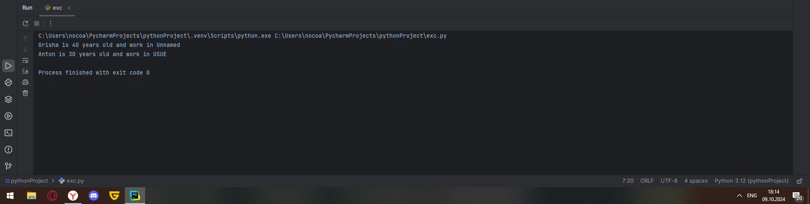

# Тема 6. Базовые коллекции: словари, кортежи
Отчет по Теме #6 выполнил(а):
- Новоселов Артем Вячеславович
- АИС-22-1

| Задание | Лаб_раб | Сам_раб |
| ------ | ------ | ------ |
| Задание 1 | + | + |
| Задание 2 | + | + |
| Задание 3 | + | + |
| Задание 4 | + | + |
| Задание 5 | + | + |
| Задание 6 |  |  |
| Задание 7 |  |  |
| Задание 8 |  |  |
| Задание 9 |  |  |
| Задание 10 |  |  |

знак "+" - задание выполнено; знак "-" - задание не выполнено;

Работу проверили:
- к.э.н., доцент Панов М.А.

## Лабораторная работа № 1
### В школе, где вы учились, узнали, что вы крутой программист и попросили написать программу для учителей, которая будет при вводе кабинета писать для него ключ доступа и статус, занят кабинет или нет. При написании программы необходимо использовать словарь (dict), который на вход получает номер кабинета, а выводит необходимую информацию. Если кабинета, который вы ввели нет в словаре, то в консоль в виде значения ключа нужно вывести “None” и виде статуса вывести “False”.
```python
request = int(input("Enter a number of classroom: "))
classrooms = {
    100: {"key": 1111, "access": True},
    101: {"key": 1212, "access": False},
    102: {"key": 2121, "access": True},
    103: {"key": 3232, "access": False},
    104: {"key": 4444, "access": False},
    None: {"key": None, "access": False}
}

response = classrooms.get(request, classrooms[None])
key = response["key"]
access = response["access"]
print(key, access)
```
### Результаты


## Лабораторная работа № 2
### Алексей решил создать самый большой словарь в мире. Для этого он придумал функцию dict_maker (**kwargs), которая принимает неограниченное количество параметров «ключ: значение» и обновляет созданный им словарь my_dict, состоящий всего из одного элемента «first» со значением «so easy». Помогите Алексею создать данную функцию.
```python
from pprint import pprint
my_dict = {"first" : "so easy"}

def dictUpdate(**kwargs):
    my_dict.update(**kwargs)

dictUpdate(a = "something", n = "anything", something = "еще что нибудь" )

pprint(my_dict)
```
### Результаты


## Лабораторная работа № 3
### Для решения некоторых задач бывает необходимо разложить строку на отдельные символы. Мы знаем что это можно сделать при помощи split(), у которого более гибкая настройка для разделения для этого, но если нам нужно посимвольно разделить строку без всяких условий, то для этого мы можем использовать кортежи (tuple). Для этого напишем любую строку, которую будем делить и “обвернем” ее в tuple и дальше мы можем как нам угодно с ней работать, например, сделать ее списком (тогда получится полный аналог split()) или же работать с ним дальше, как с кортежем.
```python
input_str = input("Введите строку\n")
input_str = tuple(input_str)
print(input_str)
```
### Результаты 


## Лабораторная работа № 4
### Вовочка решил написать крутую функцию, которая будет писать имя, возраст и место работы, но при этом на вход этой функции будет поступать кортеж. Помогите Вовочке написать эту программу.
```python
def infoAbout(name, age, job = 'Unnamed'):
    print(f"{name} is {age} years old and work in {job}")

grisha = ("Grisha", 40)
infoAbout(*grisha)

anton = ("Anton", 30, "USUE")
infoAbout(*anton)
```
### Результаты 


## Лабораторная работа № 5
### Для сопровождения первых лиц государства X нужен кортеж, но никто не может определиться с порядком машин, поэтому вам нужно написать функцию, которая будет сортировать кортеж, состоящий из целых чисел по возрастанию, и возвращает его. Если хотя бы один элемент не является целым числом, то функция возвращает исходный кортеж.
```python
def sortTuple(tpl):
    for i in tpl:
        if not isinstance(i, int):
            return tpl
    return tuple(sorted(tpl))

print(sortTuple((4,1,3,6,7,8,5,9,2)))
print(sortTuple((4,1,3,6,'7',8,5,9,2)))
```
### Результаты 


## Самостоятельная работа № 1
### При создании сайта у вас возникла потребность обрабатывать данные пользователя в странной форме, а потом переводить их в нужные вам форматы. Вы хотите принимать от пользователя последовательность чисел, разделенных пробелом, а после переформатировать эти данные в список и кортеж. Реализуйте вашу задумку. Для получения начальных данных используйте input(). Результатом программы будет выведенный список и кортеж. Реализуйте вашу задумку. Для получения начальных данных используйте input(). Результатом программы будет выведенный список и кортеж из начальных данных.
```python
num_tuple = ()

while True:
    numbers = input("Enter a number: ")
    num_tuple = numbers.strip().split(" ")
    try:
        for i in range(len(num_tuple)):
            num_tuple[i] = int(num_tuple[i])
        num_tuple = tuple(num_tuple)
    except ValueError:
        print("Принимаются только численные значения")
        continue
    break

num_list = list(num_tuple)
print(f"кортеж: {num_tuple}, список: {num_list}")
```
### Результаты

## Выводы
с помощью функции `tuple()` можно "превратить" список в кортеж

## Самостоятельная работа № 2
### Николай знает, что кортежи являются неизменяемыми, но он очень упрямый и всегда хочет доказать, что он прав. Студент решил создать функцию, которая будет удалять первое появление определенного элемента из кортежа по значению и возвращать кортеж без него. Попробуйте повторить шедевр не признающего авторитеты начинающего программиста. Но учтите, что Николай не всегда уверен в наличии элемента в кортеже (в этом случае кортеж вернется функцией в исходном виде).
Входные данные: 
    (1, 2, 3), 1) 
    (1, 2, 3, 1, 2, 3, 4, 5, 2, 3, 4, 2, 4, 2), 3)
    (2, 4, 6, 6, 4, 2), 9) 
Ожидаемый результат: 
    (2, 3) 
    (1, 2, 1, 2, 3, 4, 5, 2, 3, 4, 2, 4, 2) 
    (2, 4, 6, 6, 4, 2)
```python
def cortej(cortej):
    list1 = []
    list1.append(list(cortej[0]))
    list1.append(str(cortej[1]))
    if list1[1] in list1[0]:
        list1[0].remove(list1[1])
    cortej1 = tuple(list1[0])
    return cortej1

while True:
    a = (input("Введите числа (последнее число - то, которое нужно удалить)\n")).strip().split(" ")
    tuple1 = (tuple(a[:-1]), a[-1])
    print(f"{cortej(tuple1)}\n")
```
### Результаты

## Выводы
С помощью самописных функций можно производить различные операции с кортежами, делая из них списки и возвращая снова кортежи

## Самостоятельная работа № 3
### Преподаватель по математике придумал странную задачку. У вас есть три списка с элементами, каждый элемент которых – длина стороны треугольника, ваша задача найти площади двух треугольников, составленные из максимальных и минимальных элементов полученных списков. Результатом выполнения задачи будет: листинг кода, и вывод в консоль, в котором будут указаны два этих значения.
one = [12, 25, 3, 48, 71], two = [5, 18, 40, 62, 98], three = [4, 21, 37, 56, 84]
```python
from math import sqrt

one = [12, 25, 3, 48, 71]
two = [5, 18, 40, 62, 98]
three = [4, 21, 37, 56, 84]

max_tr = [max(one), max(two), max(three)] ## Создание максиамльного треугольника
min_tr = [min(one), min(two), min(three)] ## Создание минимального треугольника
max_per = sum(max_tr)/2 ## Полупериметр максиамльного треугольника
min_per = sum(min_tr)/2 ## Полупериметр минимального треугольника
max_plosh = sqrt(max_per * (max_per - max_tr[0])*(max_per - max_tr[1]) * (max_per - max_tr[2])) ## Площадь по теореме Герона
min_plosh = sqrt(min_per * (min_per - min_tr[0])*(min_per - min_tr[1]) * (min_per - min_tr[2]))
print(f"Максимальная площадь {max_plosh}, Минимальная площадь {min_plosh}")
```
### Результаты

## Выводы
1) `from math import sqrt` Импорт метода `sqrt` для теоремы Герона
2) `max(one)`, `min(one)` Минимальные и максимальные значения из списков
3) `sqrt(max_per * (max_per - max_tr[0])*(max_per - max_tr[1]) * (max_per - max_tr[2]))` Теорема Герона

## Самостоятельная работа № 4
### Никто не любит получать плохие оценки, поэтому Борис решил это исправить. Допустим, что все оценки студента за семестр хранятся в одном списке. Ваша задача удалить из этого списка все двойки, а все тройки заменить на четверки. Списки оценок (проверить работу программы на всех трех вариантах):
[2, 3, 4, 5, 3, 4, 5, 2, 2, 5, 3, 4, 3, 5, 4] 
[4, 2, 3, 5, 3, 5, 4, 2, 2, 5, 4, 3, 5, 3, 4] 
[5, 4, 3, 3, 4, 3, 3, 5, 5, 3, 3, 3, 3, 4, 4]
Результатом выполнения задачи будет: листинг кода, и вывод в консоль, в котором будут три обновленных массива
```python
first = [2, 3, 4, 5, 3, 4, 5, 2, 2, 5, 3, 4, 3, 5, 4]
second = [4, 2, 3, 5, 3, 5, 4, 2, 2, 5, 4, 3, 5, 3, 4]
third = [5, 4, 3, 3, 4, 3, 3, 5, 5, 3, 3, 3, 3, 4, 4]

def markChanger(list1):
    while 2 in list1:
        list1.remove(2)
    while 3 in list1:
        list1[list1.index(3)] = 4
    print(list1)

markChanger(first)
markChanger(second)
markChanger(third)
```
### Результаты

## Выводы
1) `list1.remove(2)` удаляет первую попавшуюся 2
2) ` list1.index(3)` позволяет найти индекс первой 3 в списке

## Самостоятельная работа № 5
### Вам предоставлены списки натуральных чисел, из них необходимо сформировать множества. При этом следует соблюдать это правило: если какое-либо число повторяется, то преобразовать его в строку по следующему образцу: например, если число 4 повторяется 3 раза, то в множестве будет следующая запись: само число 4, строка «44», строка «444».
list_1 = [1, 1, 3, 3, 1] list_2 = [5, 5, 5, 5, 5, 5, 5] list_3 = [2, 2, 1, 2, 2, 5, 6, 7, 1, 3, 2, 2]

```python
list_11 = [1, 1, 3, 3, 1]
list_2 = [5, 5, 5, 5, 5, 5, 5]
list_3 = [2, 2, 1, 2, 2, 5, 6, 7, 1, 3, 2, 2]

def setMaker(list1):
    set1 = set()
    for i in range(len(list1)):
        if list1[i] not in set1:
            set1.add(list1[i])
        else:
            count = list1.count(list1[i])
            while count != 1:
                set1.add(str(list1[i]) * count)
                count-=1
    print(set1)
setMaker(list_11)
setMaker(list_2)
setMaker(list_3)
```
### Результаты

## Выводы
1) Метод `count` позволяет найти, сколько раз в списке встречается необходимый элемент 
2) Множества могут хранить в себе элементы разных типов, как и списки

## Общие выводы по теме:
Списки и множества задаются в Python с помощью соответсвтующих функций `list()` и `set()`, а также благодаря () и {}.
Оба типа данных могут содержать в себе разные типы данных одновременно. Списки в отличии от множеств могут содеражать идентичные элементы. Также элементы в списках имеют соответсвубщие индексы, в отличии от множеств 
