# Тема 7. Работа с файлами (ввод, вывод)
Отчет по Теме #7 выполнил(а):
- Новоселов Артем Вячеславович
- АИС-22-1

| Задание | Лаб_раб | Сам_раб |
| ------ | ------ | ------ |
| Задание 1 | + | + |
| Задание 2 | + | + |
| Задание 3 | + | + |
| Задание 4 | + | + |
| Задание 5 | + | + |
| Задание 6 |  |  |
| Задание 7 |  |  |
| Задание 8 |  |  |
| Задание 9 |  |  |
| Задание 10 |  |  |

знак "+" - задание выполнено; знак "-" - задание не выполнено;

Работу проверили:
- к.э.н., доцент Панов М.А.

## Лабораторная работа № 1
### Составьте текстовый файл и положите его в одну директорию с программой на Python. Текстовый файл должен состоять минимум из двух строк
```python
## Только скрин
```
### Результаты
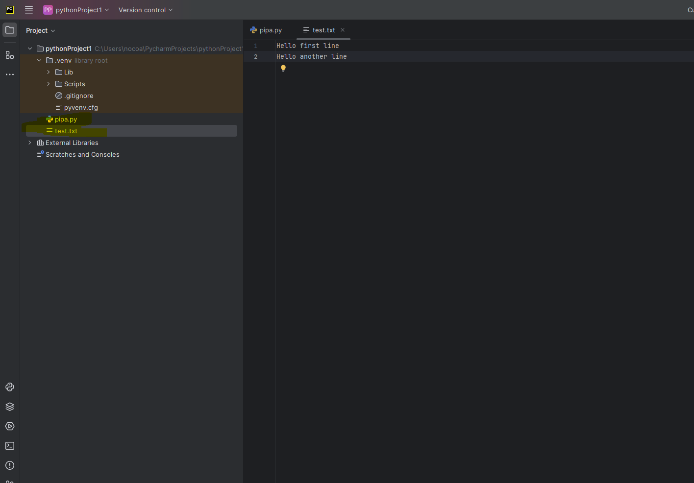


## Лабораторная работа № 2
### Напишите программу, которая выведет только первую строку из вашего файла, при этом используйте конструкцию open()/close().
```python
f = open('test.txt', 'r')
print(f.readline())
f.close()
```
### Результаты
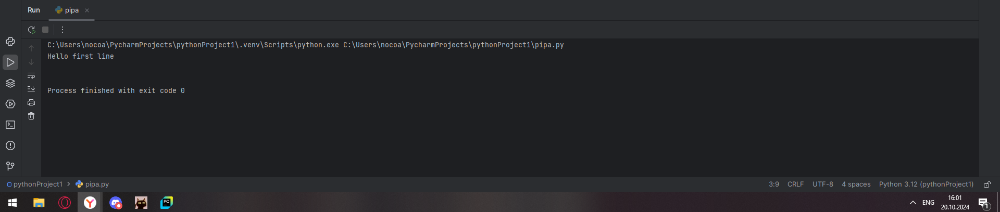


## Лабораторная работа № 3
### Напишите программу, которая выведет все строки из вашего файла в массиве, при этом используйте конструкцию open()/close().
```python
f = open('test.txt', 'r')
print(f.readlines())
f.close()
```
### Результаты 
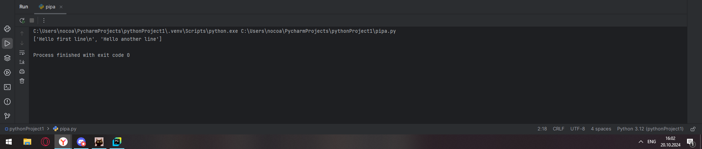


## Лабораторная работа № 4
### Напишите программу, которая выведет все строки из вашего файла в массиве, при этом используйте конструкцию with open()
```python
with open('test.txt') as f:
    print(f.readlines())
```
### Результаты 
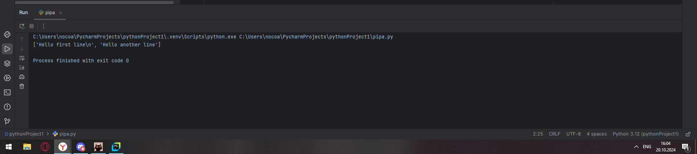

## Лабораторная работа № 5
### Напишите программу, которая выведет каждую строку из вашего файла отдельно, при этом используйте конструкцию with open()
```python
with open('test.txt') as f:
    for line in f:
        print(line)
```
### Результаты 
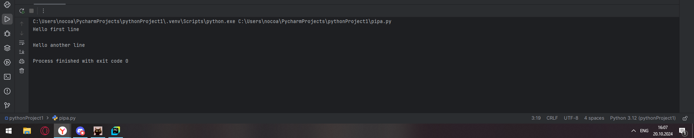

## Лабораторная работа № 6
### Напишите программу, которая будет добавлять новую строку в ваш файл, а потом выведет полученный файл в консоль. Вывод можно осуществлять любым способом. Обязательно проверьте сам файл, чтобы изменения в нем тоже отображались
```python
with open('test.txt', 'a+') as f:
    f.write('\nAdded line')

with open('test.txt') as f:
    for line in f:
        print(line)
```
### Результаты 
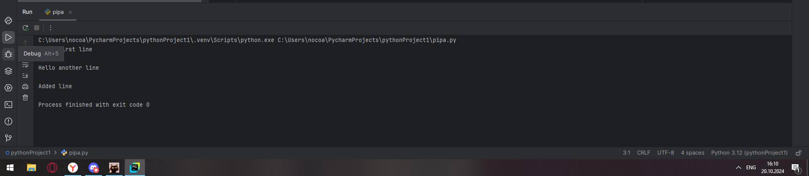


## Лабораторная работа № 7
### Напишите программу, которая перепишет всю информацию, которая была у вас в файле до этого, например напишет любые данные из произвольно вами составленного списка. Также не забудьте проверить что измененная вами информация сохранилась в файле.
```python
lines = ['1', '2', '3']
with open('test.txt', 'w') as f:
    for line in lines:
        f.write('\n step' + line)
    print('complite')
```
### Результаты 
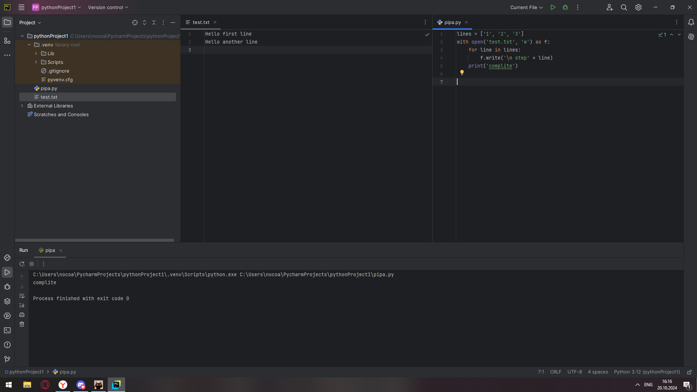
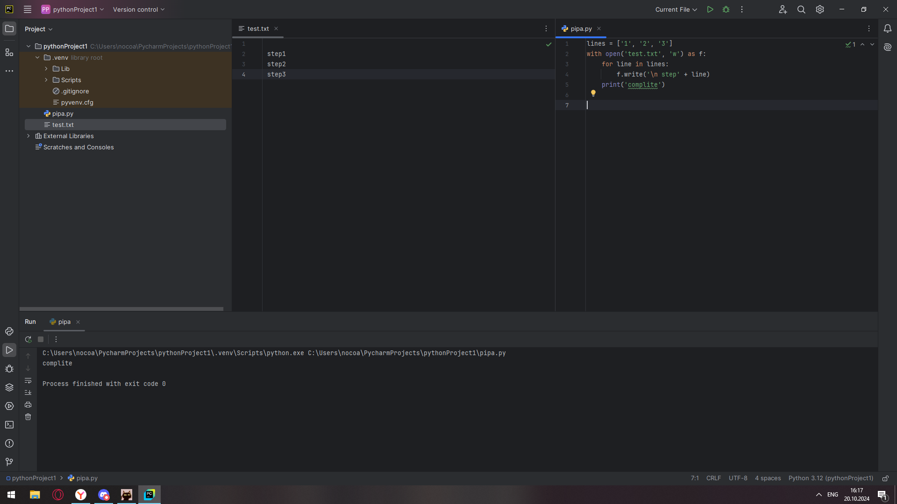


## Самостоятельная работа № 1
### При создании сайта у вас возникла потребность обрабатывать данные пользователя в странной форме, а потом переводить их в нужные вам форматы. Вы хотите принимать от пользователя последовательность чисел, разделенных пробелом, а после переформатировать эти данные в список и кортеж. Реализуйте вашу задумку. Для получения начальных данных используйте input(). Результатом программы будет выведенный список и кортеж. Реализуйте вашу задумку. Для получения начальных данных используйте input(). Результатом программы будет выведенный список и кортеж из начальных данных.
```python
num_tuple = ()

while True:
    numbers = input("Enter a number: ")
    num_tuple = numbers.strip().split(" ")
    try:
        for i in range(len(num_tuple)):
            num_tuple[i] = int(num_tuple[i])
        num_tuple = tuple(num_tuple)
    except ValueError:
        print("Принимаются только численные значения")
        continue
    break

num_list = list(num_tuple)
print(f"кортеж: {num_tuple}, список: {num_list}")
```
### Результаты
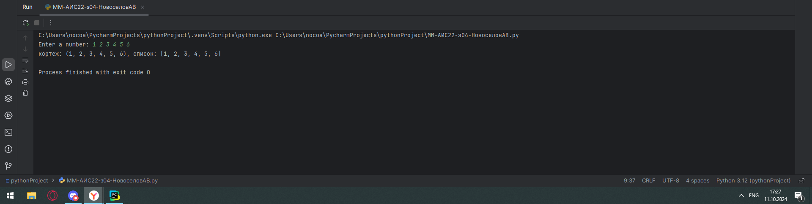
## Выводы
с помощью функции `tuple()` можно "превратить" список в кортеж

## Самостоятельная работа № 2
### Николай знает, что кортежи являются неизменяемыми, но он очень упрямый и всегда хочет доказать, что он прав. Студент решил создать функцию, которая будет удалять первое появление определенного элемента из кортежа по значению и возвращать кортеж без него. Попробуйте повторить шедевр не признающего авторитеты начинающего программиста. Но учтите, что Николай не всегда уверен в наличии элемента в кортеже (в этом случае кортеж вернется функцией в исходном виде).
Входные данные: 
    (1, 2, 3), 1) 
    (1, 2, 3, 1, 2, 3, 4, 5, 2, 3, 4, 2, 4, 2), 3)
    (2, 4, 6, 6, 4, 2), 9) 
Ожидаемый результат: 
    (2, 3) 
    (1, 2, 1, 2, 3, 4, 5, 2, 3, 4, 2, 4, 2) 
    (2, 4, 6, 6, 4, 2)
```python
def cortej(cortej):
    list1 = []
    list1.append(list(cortej[0]))
    list1.append(str(cortej[1]))
    if list1[1] in list1[0]:
        list1[0].remove(list1[1])
    cortej1 = tuple(list1[0])
    return cortej1

while True:
    a = (input("Введите числа (последнее число - то, которое нужно удалить)\n")).strip().split(" ")
    tuple1 = (tuple(a[:-1]), a[-1])
    print(f"{cortej(tuple1)}\n")
```
### Результаты
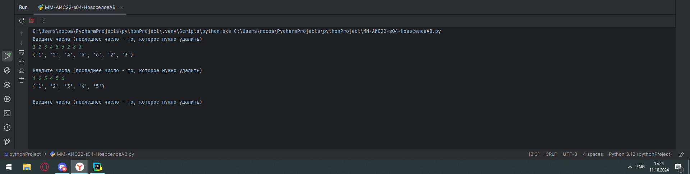
## Выводы
С помощью самописных функций можно производить различные операции с кортежами, делая из них списки и возвращая снова кортежи

## Самостоятельная работа № 3
### Ребята поспорили кто из них одним нажатием на numpad наберет больше повторяющихся цифр, но не понимают, как узнать победителя. Вам им нужно в этом помочь. Дана строка в виде случайной последовательности чисел от 0 до 9 (длина строки минимум 15 символов). Требуется создать словарь, который в качестве ключей будет принимать данные числа (т. е. ключи будут типом int), а в качестве значений – количество этих чисел в имеющейся последовательности. Для построения словаря создайте функцию, принимающую строку из цифр. Функция должна возвратить словарь из 3-х самых часто встречаемых чисел, также эти значения нужно вывести в порядке возрастания ключа
```python
def num_counter(line):
    count_dict = {}
    for i in range(9):
        i = str(i)
        if i in line:
            count_dict[i] = line.count(i)
    new_dict = count_dict.items()
    new_dict = sorted(new_dict, key = lambda k: k[1], reverse = True)
    new_dict = dict(new_dict[:3])
    return new_dict

line  = input("Введите последовательность\n")
print(num_counter(line))
```
### Результаты
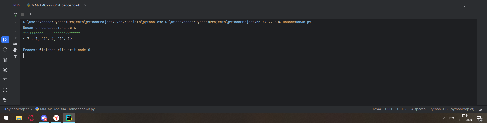
## Выводы
`dict.items()` : позволяет вернуть список списков с 2 элементами вида `((ключ, значение), (ключ, значение)...)` 

## Самостоятельная работа № 4
### НВаш хороший друг владеет офисом со входом по электронным картам, ему нужно чтобы вы написали программу, которая показывала в каком порядке сотрудники входили и выходили из офиса. Определение сотрудника происходит по id. Напишите функцию, которая на вход принимает кортеж и случайный элемент (id), его можно придумать самостоятельно. Требуется вернуть новый кортеж, начинающийся с первого появления элемента в нем и заканчивающийся вторым его появлением включительно. Если элемента нет вовсе – вернуть пустой кортеж. Если элемент встречается только один раз, то вернуть кортеж, который начинается с него и идет до конца исходного. 
Входные данные:
(1, 2, 3), 8) 
(1, 8, 3, 4, 8, 8, 9, 2), 8) 
(1, 2, 8, 5, 1, 2, 9), 8) 
Ожидаемый результат: 
() 
(8, 3, 4, 8) 
(8, 5, 1, 2, 9)
```python
def work_searcher(line):
    line = line.replace("(", "").replace(")", "").replace(",", "")
    line = line.strip().split()
    elm = line.pop()
    if elm in line:
        first_elm = line.index(elm);
        line = line[first_elm:]
        if elm in line[1:]:
            a = line[1:].index(elm)
            line = line[:line[1:].index(elm)+first_elm+1]
        return tuple(line)
    else:
        return ()

##(1, 8, 3, 4, 8, 8, 9, 2), 8)   (1, 2, 3), 8)    (1, 2, 8, 5, 1, 2, 9), 8)
while True:
    line = input("Введите входные данные:\n")
    print(work_searcher(line))
```
### Результаты
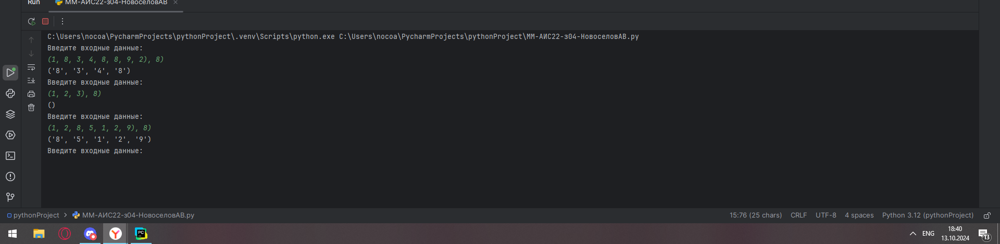
## Выводы
Строки в python поддерживают цепочку методов, чтол помогает использовать минимум строчек при работе с ними (например при форматировании)

## Самостоятельная работа № 5
### Самостоятельно придумайте и решите задачу, в которой будут обязательно использоваться кортеж или список. Проведите минимум три теста для проверки работоспособности вашей задачи
### Написать функцию, которая принимает на вход данные вида `(1, 8, 3, 4, 8, 8, 9, 2), 8)` разного вида, а возвращает соответствующий кортеж
```python
def work_searcher(line):
    line = line.replace("(", "").replace(")", "").replace(",", "")
    line = line.strip().split()
    for i in range(len(line)):
        line[i] = int(line[i])
    new_line = [0, 1]
    new_line[0] = tuple(line[:-1])
    new_line[1] = line[-1]
    return tuple(new_line)


##(1, 8, 3, 4, 8, 8, 9, 2), 8)      (1, 2, 3), 8)       (1, 2, 8, 5, 1, 2, 9), 8)
while True:
    line = input("Введите входные данные:\n")
    print(work_searcher(line))
```
### Результаты
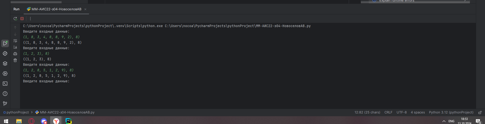
## Выводы
`tuple(list)` способен трансформировать список в кортеж, не изменяя тип вложенных элементов

## Общие выводы по теме:
Словари в Python являются удобным типом данных, если необходимо использовать данные вида ключ: значение
Кортежи в Python являются удобным типом данных, есои нужно использовать неизменяемый упорядоченный список
